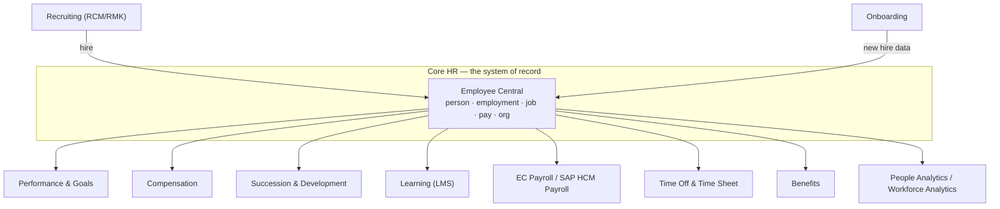

# The HXM Suite — module map

## Why you need this map

Employee Central does not live alone. In almost every project, EC is the **source of truth** and other modules *consume* its data. When an interviewer asks "how does EC talk to Recruiting?", they are testing whether you understand that EC is the hub, not one of the spokes.

---

## The modules, one line each

### Core HR

| Module | What it does | Relationship to EC |
|---|---|---|
| **Employee Central (EC)** | System of record: who someone is, their employment, job, pay, and the organisation they sit in | *is* the core |
| **EC Payroll (ECP)** | SAP payroll engine delivered in the cloud, fed from EC | Downstream — receives replicated employee data |
| **Time Off / Time Sheet** | Absence quotas, leave requests, time recording | EC sub-module; uses EC job data and workflows |
| **Benefits** | Enrolments, entitlements, claims | EC sub-module built entirely on MDF |
| **Position Management** | Positions, position hierarchy, headcount control | EC sub-module; drives Job Information |
| **Document Generation** | Offer letters, contracts, confirmation letters from templates | Reads EC data |

### Talent

| Module | What it does | Relationship to EC |
|---|---|---|
| **Recruiting (RCM)** + **Recruiting Marketing (RMK)** | Requisitions, applications, offers, career site | Feeds a hire into EC; a job requisition can be created *from* an EC position |
| **Onboarding (ONB)** | Pre-day-one paperwork, equipment, buddy, crossboarding, offboarding | Creates the new hire in EC |
| **Performance & Goals (PMGM)** | Goal plans, performance forms, calibration, 360 | Consumes EC job/manager data |
| **Compensation & Variable Pay** | Merit, bonus, stock planning cycles | Reads EC salary; writes results back as pay components |
| **Succession & Development** | Talent pools, 9-box, successors, development plans | Uses EC position and job data |
| **Learning (LMS)** | Courses, curricula, compliance training, certifications | Consumes EC org data for assignment rules |
| **Opportunity Marketplace / Growth Portfolio** | Internal gigs, mentoring, skills | Uses EC profile + skills |

### Platform and analytics

| Module | What it does |
|---|---|
| **Platform** | The shared layer: login, People Profile, home page, RBP, MDF, business rules, workflows, Integration Center, notifications |
| **People Analytics / Story reports** | Reporting and dashboards over EC and talent data |
| **Workforce Analytics / Planning** | Curated HR metrics, benchmarking, headcount planning |
| **SAP BTP extensions** | Where genuinely custom applications go when configuration is not enough |

---

## The two "profiles" that confuse everyone

SuccessFactors has **two overlapping employee records**, a legacy of its history:

1. **Employee Profile** — the *talent* record (background elements: education, certifications, work experience, competencies). Defined in the **Succession Data Model**. Existed before EC.
2. **Employee Central data** — the *HR* record (Personal Information, Job Information, Compensation, Addresses). Defined in the **Succession Data Model** (employee-level HRIS elements) plus the **Corporate Data Model** (foundation objects).

Both are surfaced today in one screen — **People Profile** — which is why beginners cannot tell them apart. The tell: if the block is *effective-dated with history and an event reason*, it is EC data. If it is a list you simply add rows to, it is usually a talent background element.

---

## Which modules need EC, and which can live without it

- **Cannot sensibly run without core HR data:** Compensation, Succession, Position Management, Time, Benefits, ECP.
- **Can run standalone (and often do, as a first phase):** Recruiting, Performance & Goals, Learning. Many customers buy PMGM or LMS first and add EC later — in which case employee data arrives by flat-file import into **Employee Profile**, not EC.

That "SF without EC" landscape still exists in the wild. If an interviewer describes a client with LMS and PMGM but a flat-file employee import, they are describing exactly this.

---

## Real world example

A pharmaceutical company runs a three-wave programme:

- **Wave 1** — EC + Time Off. Everything else waits, because without a trusted core record the other modules would inherit bad data.
- **Wave 2** — Recruiting + Onboarding. A requisition is now created against an *EC position*, and a hire flows into EC without re-keying.
- **Wave 3** — Compensation + Succession, which read EC salary and position data on day one.

The sequencing is not an accident: **core first, then the modules that consume core**. See [Recommended implementation sequence](../11_Implementation_and_Testing/02_Recommended_Implementation_Sequence.md).

---

## Interview-grade Q&A

- **Name the modules of the HXM suite.** Core HR: EC, EC Payroll, Time, Benefits, Position Management. Talent: Recruiting, Onboarding, Performance & Goals, Compensation, Succession & Development, Learning. Plus Platform and People Analytics.
- **What is the difference between Employee Profile and Employee Central?** Employee Profile is the talent record (background elements, defined in the Succession Data Model); EC is the effective-dated HR system of record (person, employment, job, compensation, org).
- **Can Recruiting run without EC?** Yes — many customers implement RCM standalone and load employee data by file. Integration to EC just makes hiring seamless.
- **Which modules consume EC data most heavily?** Compensation, Succession, Position Management, Time, Benefits and Payroll.
- **Where would you build something the suite cannot do?** MDF first (custom object plus rules). Only if that fails, an extension on SAP BTP.

---

## Further learning

- SAP Learning — [Platform Introduction Academy](https://learning.sap.com/courses/sap-successfactors-platform-introduction-academy)
- SAP Help — [SAP SuccessFactors HXM Suite documentation](https://help.sap.com/docs/SAP_SUCCESSFACTORS_PLATFORM)
- Video — [SuccessFactors suite overview](https://www.youtube.com/watch?v=6xrD8Vkm0QI)
- Video — [Navigation and architecture](https://www.youtube.com/watch?v=qkmFdj4h4rA)
