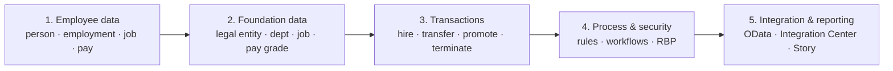

# What is Employee Central?

## Plain definition

**Employee Central (EC)** is the core HR module of SAP SuccessFactors — the **system of record** for people and the organisation. It answers, for any date in the past, present or planned future:

- **Who** is this person? (name, date of birth, address, national ID)
- **What is their relationship to the company?** (hired when, which legal entity, still employed?)
- **What do they do?** (job title, department, manager, location, FTE, position)
- **What do they earn?** (base salary, allowances, pay grade, frequency)
- **What does the organisation look like?** (legal entities, business units, divisions, departments, cost centres, locations, jobs, pay grades)

It is commonly described as **"the cloud version of SAP HCM"** — more precisely, the cloud successor to SAP HCM's **Personnel Administration (PA)** and **Organizational Management (OM)**.

Analogy: EC is the **HR ledger**. Like a financial ledger, you don't overwrite entries — you *post a new one with a date and a reason*, and the old one stays visible. That single idea (effective dating with event reasons) is what separates EC from a spreadsheet.

---

## The five pillars of EC

1. **Employee data** — the record of a person and their employment, effective-dated. → [02_Employee_Data](../02_Employee_Data/00_Employee_Data_Learning_Path.md)
2. **Foundation data** — the shared organisational, job and pay structures every employee record points at. → [03_Foundation_Objects](../03_Foundation_Objects/00_Foundation_Objects_Learning_Path.md)
3. **Transactions** — the events that change the record over time. → [07_Transactions_and_Workflows](../07_Transactions_and_Workflows/00_Transactions_Learning_Path.md)
4. **Process and security** — business rules, workflows, role-based permissions. → [06](../06_Business_Rules/00_Business_Rules_Learning_Path.md) · [08](../08_Security_RBP/00_RBP_Learning_Path.md)
5. **Integration and reporting** — getting data out, and keeping downstream systems in step. → [10_Integrations](../10_Integrations/00_Integrations_Learning_Path.md)

Every EC topic you will ever study belongs to one of those five buckets. When you feel lost, ask which bucket you are in.

---

## The three-layer data structure (the thing to memorise first)

EC does not store "an employee". It stores three linked things:

| Layer | Key | Holds | Example fields |
|---|---|---|---|
| **Person** | `person_id_external` | Facts true about the *human being*, regardless of jobs | Date of birth, gender, home address, national ID, emergency contact |
| **Employment** | `user_id` / assignment ID | Facts about *one working relationship* with the company | Hire date, termination date, seniority date, assignment type |
| **Job / Compensation** | effective-dated rows under the employment | What they do and earn, over time | Position, department, manager, FTE, salary, pay grade |

One person can have **more than one employment**: rehired later, a global assignment, or two concurrent jobs. That is exactly why Person and Employment are separate — and it is the single most-asked EC design question.

Full treatment: [Person, User and Employment](../02_Employee_Data/01_Person_User_Employment_Model.md).

---

## What EC gives an HR department

- **One record, one truth** — no more country spreadsheets.
- **Time travel** — see the organisation as it was on any past date, or as it *will be* on a future date (future-dated transfers are normal, not a hack).
- **Self-service** — employees update their own address; managers initiate transfers; workflows route the approvals.
- **Auditability** — every change carries a date, an event, an event reason and a user.
- **Global compliance** — country-specific fields and formats are shipped by SAP and switched on per country.
- **A clean integration surface** — OData entities for everything, so downstream systems stop asking for CSV extracts by email.

## Where EC frustrates people

- **Effective dating is unforgiving.** Enter the wrong date and you have a wrong history, not just a wrong value. Correcting versus inserting is a skill in itself.
- **Foundation data must exist first.** You cannot hire into a department that has not been created.
- **Rules can fight each other.** Two rules writing the same field on the same event is the classic production defect.
- **Permissions are granular to the point of pain.** "The field is there but I can't see it" is nearly always RBP.

---

## Real world example — one promotion, end to end

Priya is promoted from Analyst to Senior Analyst on 1 April, with a salary increase.

1. Her manager opens **Take Action → Change Job and Compensation**, sets the effective date to 01-Apr.
2. He changes Job Classification to Senior Analyst. A **business rule** derives Event = *Job Change* and Event Reason = *Promotion*, and defaults the new Pay Grade from the job.
3. He enters the new base salary; another rule validates it against the Pay Range for that grade.
4. On Save, a **workflow** routes to HRBP → Compensation Partner.
5. Until approved, the change sits as **pending data** — Priya's live record is untouched.
6. On approval, a new effective-dated row appears in **Job Information** and **Compensation Information** starting 01-Apr. The 31-March row remains, forever.
7. Overnight, the **replication** to payroll picks up the change; Compensation and Succession see the new grade next time they read EC.

Every folder in this repo shows up in that one story. That is the shape of the whole product.

---

## Interview-grade Q&A

- **What is Employee Central?** SAP SuccessFactors' core HR module — the effective-dated system of record for person, employment, job, compensation and organisational data.
- **Is EC the same as SAP HCM?** It is the cloud successor to SAP HCM PA and OM. Payroll may stay on SAP HCM or move to EC Payroll; EC itself is not a payroll engine.
- **What are EC's main building blocks?** Employee data, foundation objects, transactions (events and event reasons), business rules/workflows/RBP, and integration/reporting.
- **Why are Person and Employment separate?** Because one human can hold several employments over time or at once (rehire, global assignment, concurrent employment). Person-level data is shared; employment-level data is per assignment.
- **What makes EC different from a normal HR database?** Effective dating: records are inserted with a validity period and a reason, not overwritten, so the full history and future are queryable.
- **Does EC calculate payroll?** No. It holds pay *data* (pay components) and hands it to a payroll engine — EC Payroll, SAP HCM Payroll, or a third party.

---

## Further learning

- SAP Learning — [Employee Central Core Academy](https://learning.sap.com/courses/sap-successfactors-employee-central-core-academy)
- SAP Help — [Implementing Employee Central Core](https://help.sap.com/docs/successfactors-employee-central/implementing-employee-central-core)
- Video — [Employee Central overview](https://www.youtube.com/watch?v=6xrD8Vkm0QI)
