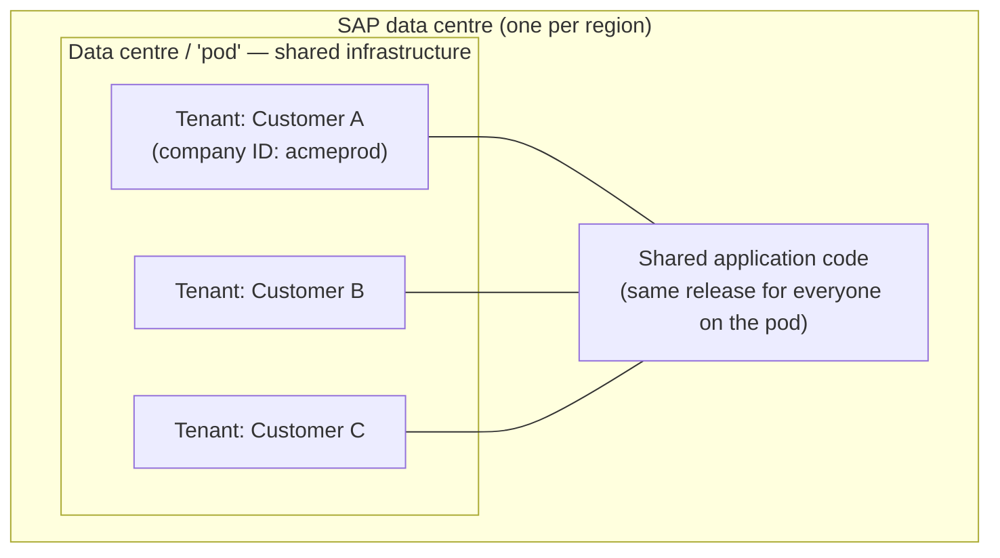

# Architecture, instances and landscape

## Multi-tenant SaaS in one picture

Key consequences of that picture — each one shows up in real projects:

- **Shared code, separate data.** Every customer on a data centre runs the *same* application version. Your configuration and your data are yours; the code is not.
- **You cannot patch the code.** No hotfix, no ABAP, no debugger. You raise an incident with SAP.
- **Release timing is regional.** Preview and production windows are announced per data centre.
- **Performance is shared.** A very large import can be throttled; batch jobs run in queues.

---

## Instance, tenant, company ID

| Term | Meaning |
|---|---|
| **Instance / tenant** | One isolated copy of the application, with its own configuration and data |
| **Company ID** | The unique identifier for that tenant — you type it at login (e.g. `acmeCorpDEV`) |
| **Data centre (DC)** | The SAP region hosting the tenant (EU, US, APJ, and so on) — matters for data residency |
| **Provisioning** | The partner-only back-office tool that manages tenants and low-level switches |

A customer typically buys **two or three** tenants:

| Tenant | Purpose | Typical data |
|---|---|---|
| **DEV / Config** | Build and unit test | Small test population, may be sanitised |
| **TEST / QA (sometimes "Stage")** | String test, UAT, integration test, training | Full copy or masked copy of production |
| **PROD** | The live system | Real people, real payroll consequences |

Some programmes add a **sandbox** for training and demos, or a dedicated **payroll test** tenant.

---

## How configuration moves between instances

There is no transport request. Three mechanisms, in order of preference:

### 1. Instance Sync (a.k.a. Instance Synchronization Tool)

Copies selected configuration artefacts from a source tenant to a target tenant — data models, MDF objects, rules, role-based permissions, picklists, templates, and so on, depending on release support.

- Runs as a job you define, review and then execute.
- Includes a **preview/compare** so you can see what will change.
- **Not everything is supported** — always check the supported-artefact list for your release, and keep a manual fallback.

### 2. Export / import

- Data models: **download XML from Provisioning or Business Configuration UI, upload to the target**.
- MDF objects and data: **Import and Export Data** (object definitions and records as CSV/ZIP).
- Picklists: export/import CSV.
- Rules and workflows: often re-created manually, or moved via Instance Sync.

### 3. Manual re-configuration

Slow, error-prone, but sometimes unavoidable. This is why a written **configuration workbook** matters: it *is* your transport request.

> **Golden rule:** whatever you build in DEV, record in the workbook the same day. Six weeks later, nobody remembers why a rule exists.

---

## Refreshing test from production

Customers periodically ask to **refresh** TEST with a copy of PROD, so UAT runs against real data volumes. Things to know:

- It is requested through SAP (a service request), not self-service.
- It **overwrites** the target — any configuration built in TEST since the last refresh is lost unless you migrated it back first.
- Data privacy: refreshed non-production tenants hold real personal data. Most customers require **data masking/anonymisation** and restricted access afterwards, and email sending must be suppressed so test emails do not reach real employees.

That last point is a favourite interview trap: *"You refreshed test from prod. What is the first thing you check?"* Answer: **email notifications are switched off**, then access is locked down.

---

## Data residency and integration surface

- **Data residency** — tenants live in a chosen SAP data centre; European customers usually require an EU DC. This is contractual and cannot be changed casually.
- **Integration surface** — the tenant is reached over HTTPS: OData API, SFAPI/Compound Employee API (SOAP), SFTP for file exchange, and SAML SSO for login. There is no VPN into an SAP data centre for you.
- **Authentication** — normally SAML 2.0 SSO against the customer's identity provider, with a small number of local admin/API accounts. API access uses **OAuth 2.0 with SAML bearer assertion** (preferred) or basic authentication where still permitted.
- **IP restrictions** — an instance can be locked to allowed IP ranges; forget that and your integration fails with a login error rather than an obvious network error.

---

## Real world example

A programme runs three tenants: `acmeDEV`, `acmeTEST`, `acmePROD` in the EU data centre.

- Consultants build in **DEV** and record everything in the workbook.
- Every fortnight, config moves to **TEST** through Instance Sync; anything unsupported is re-done manually against the workbook.
- UAT runs in TEST against a masked production copy.
- Two weeks before go-live, TEST is refreshed from PROD (which at that point holds only migrated foundation data) to validate the real load.
- Go-live weekend: config is applied to **PROD**, employee data is loaded, integrations are pointed at PROD endpoints, and email is switched on *last*.

Nothing about that sequence is optional; every failed go-live you will hear about skipped one of those steps.

---

## Interview-grade Q&A

- **Describe the SuccessFactors landscape.** Multi-tenant SaaS: shared application code per data centre, isolated tenant data. Customers typically have DEV, TEST and PROD tenants identified by company ID.
- **How do you transport configuration?** There is no transport request. Instance Sync where supported, export/import of XML, MDF and picklists otherwise, and manual re-configuration as a fallback — all backed by a configuration workbook.
- **What are the risks of a production-to-test refresh?** Configuration in the target is overwritten, and real personal data lands in a lower environment — so mask data, restrict access, and disable outbound email.
- **How do users log in?** Usually SAML SSO against the customer IdP; API integrations use OAuth 2.0 SAML bearer assertion.
- **Can you debug or patch the application?** No. You configure; defects in standard behaviour go to SAP as incidents.
- **Why does the data centre matter?** Data residency and release timing are both determined by it.

---

## Further learning

- SAP Help — [SAP SuccessFactors platform documentation](https://help.sap.com/docs/SAP_SUCCESSFACTORS_PLATFORM)
- SAP Learning — [Platform Introduction Academy](https://learning.sap.com/courses/sap-successfactors-platform-introduction-academy)
- Video — [Navigation and architecture](https://www.youtube.com/watch?v=qkmFdj4h4rA)
