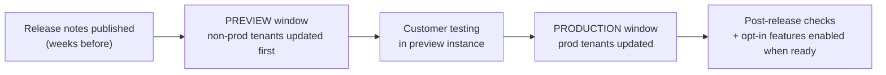

# Release cycle and Upgrade Center

## The rhythm

SAP SuccessFactors ships **two major releases a year** (commonly referred to by half-year, e.g. 1H and 2H). Each release follows the same rhythm:

- **Preview first.** Non-production ("preview") tenants get the release ahead of production, giving a testing window — typically a few weeks.
- **Production follows** on a published date per data centre.
- **You cannot decline the release.** You can only decline the *optional* parts of it.

Analogy: the building repaints the corridors on a fixed schedule (universal). Whether you hang the new shelving they offer inside your flat is your call (opt-in).

---

## Universal vs opt-in

| | **Universal** | **Opt-in (optional)** |
|---|---|---|
| Applied | Automatically to everyone | Only when an admin enables it |
| Choice | None | Yours, and usually reversible for a while |
| Examples | UI refreshes, standard field behaviour changes, API changes, deprecations | New sub-features, new object types, new UIs replacing old ones |
| Your job | **Test that nothing broke** | **Evaluate, test, then enable deliberately** |

A third category matters at the tail end: **deprecations / end-of-maintenance**. SAP announces that an old feature will stop working in a future release. Ignoring those announcements is how customers arrive at a forced migration with two weeks' notice.

---

## The tools

| Tool | What it does |
|---|---|
| **What's New Viewer** | The searchable release-notes site: filter by module, release, and type (universal / opt-in / deprecation) |
| **Upgrade Center** (Admin Center) | Lists optional upgrades available to *your* instance; lets you read, enable, and sometimes revert them. Also shows required upgrades with deadlines |
| **Release Information / Customer Community** | Dates per data centre, known issues, webinars |
| **Check Tool** | Runs configuration health checks — often updated each release with new checks; run it after every upgrade |

---

## What a consultant actually does each release

A repeatable, four-week routine:

**T-4 weeks — read**
1. Open What's New Viewer, filter to the modules the customer uses.
2. Classify every item: *universal* (test it), *opt-in* (evaluate it), *deprecation* (plan for it).
3. Produce a short impact list for the customer — usually one page.

**T-2 weeks — test in preview**
4. Run the **regression pack**: hire, transfer, promote, terminate, rehire, a payroll-relevant change, one workflow of each type, one integration run, key reports.
5. Focus especially on anything touched by universal changes.
6. Run **Check Tool** and clear new findings.
7. Log defects to SAP early — before production date, not after.

**T-1 week — decide**
8. Agree with the customer which opt-ins to take now, which to defer.
9. Note anything requiring communication to end users (a changed screen is a support-ticket generator).

**After production release**
10. Smoke-test production: login, one hire, one approval, one integration, one report.
11. Enable agreed opt-ins **one at a time**, with testing between.
12. Update the configuration workbook.

Interviewers love this question because it separates people who have *lived* through releases from people who have only configured.

---

## Common release-time failures

- **Nobody tested integrations.** An API change or a new mandatory field breaks a nightly interface at 02:00 the following Monday.
- **A business rule silently changes behaviour** because rule-engine handling of an edge case was corrected. Your "working" rule was relying on a bug.
- **Custom labels or overrides get reset** by a UI replacement.
- **An opt-in was enabled in preview and forgotten in production**, so TEST and PROD no longer match. Track opt-ins per environment.
- **Deprecation ignored** — for example an old picklist model, an old UI, or an old API version reaching end of maintenance.

---

## Real world example

A customer runs EC, Time Off and Recruiting. In the release notes, three things matter:

1. **Universal:** a change to how a standard EC field is validated on save. → Their custom onSave rule now fires in a different order; found in preview testing, rule adjusted in one afternoon.
2. **Opt-in:** a new UI for a Time Off admin screen. → Deferred one release, because UAT time was short and the old screen still works.
3. **Deprecation:** an older API version they use in one nightly interface will end in twelve months. → Added to the backlog with a date, not left to chance.

Total effort: about three days spread across four weeks. Skipping it costs far more.

---

## Interview-grade Q&A

- **How often does SuccessFactors release?** Twice a year, with a preview window on non-production tenants before production.
- **Universal vs opt-in?** Universal changes apply automatically to everyone; opt-in features must be enabled by an admin, typically through Upgrade Center.
- **Can a customer skip a release?** No. Only the optional parts are a choice.
- **How do you prepare for a release?** Read What's New Viewer filtered to the customer's modules, classify each item, regression-test in preview, run Check Tool, agree opt-ins, then smoke-test production and enable opt-ins one at a time.
- **What is Upgrade Center?** The Admin Center tool listing optional and required upgrades for your instance, with descriptions and the ability to enable them.
- **What typically breaks at a release?** Integrations, rules that depended on undocumented behaviour, and custom UI overrides.
- **What is Check Tool?** A configuration health-check tool; new checks arrive with releases, so run it after every upgrade.

---

## Further learning

- SAP — [What's New Viewer](https://help.sap.com/whats-new/)
- SAP Help — [SAP SuccessFactors platform documentation](https://help.sap.com/docs/SAP_SUCCESSFACTORS_PLATFORM)
- SAP Learning — [Platform Introduction Academy](https://learning.sap.com/courses/sap-successfactors-platform-introduction-academy)
- Video — [SuccessFactors overview](https://www.youtube.com/watch?v=6xrD8Vkm0QI)
