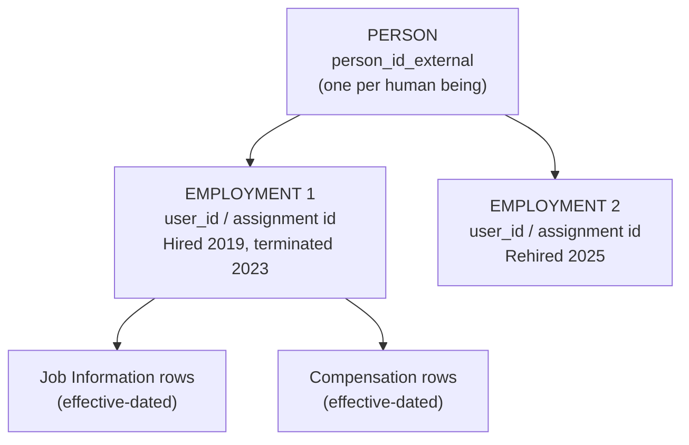

# Person, User and Employment — the three-layer model

## Why this note comes first

If you understand nothing else about Employee Central, understand this. Almost every "why does EC behave like that?" question resolves to the separation of **Person**, **Employment** and **User**.

Analogy: think of a **passport, a job contract, and a building pass**.

- The **passport** is the person — one per human, for life.
- A **contract** is an employment — you can hold more than one over your life, and occasionally more than one at the same time.
- The **building pass** is the user account — it is what logs in and what other systems reference.

---

## The three layers

| Layer | Key field | Scope of the data | Examples |
|---|---|---|---|
| **Person** | `person_id_external` | True about the human, independent of any job | Date of birth, place of birth, gender, home address, national ID, emergency contact, dependants |
| **Employment** | `user_id` (assignment ID) | True about one working relationship | Hire date, original start date, seniority date, termination date, assignment type, is-primary flag |
| **Job / Compensation / etc.** | effective-dated child records of the employment | What they do and earn, over time | Position, department, manager, FTE, salary, pay grade |
| **User** | `user_id` / `username` | The login and the suite-wide identity | Username, email for login, status (active/inactive), locale, proxy rights |

### The key you actually type

- **`person_id_external`** — the person key. In imports, this is what ties Personal Info, Addresses and National ID to the right human.
- **`user_id`** — the employment/user key. This is what Job Information, Compensation, workflows, permissions, and every other module reference.
- **`assignment_id_external`** — the external key for the employment, used in newer imports and APIs; when there is exactly one employment, it commonly mirrors the user ID.

**Rule of thumb:** person-level data keys on `person_id_external`; employment-level data keys on `user_id` / `assignment_id_external`.

---

## Which data sits at which level

| Person level (shared across all employments) | Employment level (per assignment) |
|---|---|
| Biographical Information (`personInfo`) | Employment Information (`employmentInfo`) |
| Personal Information (`personalInfo`) | Job Information (`jobInfo`) |
| Global Information (country-specific person data) | Compensation Information (`compInfo`) |
| Addresses (`homeAddress`) | Pay Components — recurring and non-recurring |
| Email, Phone, Social accounts | Job Relationships (`jobRelationsInfo`) |
| National ID Card | Work Permit Info |
| Emergency Contact | Global Assignment details |
| Dependants / Person Relationships | Termination details |
| Payment Information (bank) — person level in most designs | Position assignment |

Ask yourself: *"if this person quit and came back in five years, would this fact still be true?"* If yes → Person. If no → Employment.

---

## Why the split exists — three scenarios it makes possible

**1. Rehire.** Anita works 2019–2023, leaves, returns in 2025. Her date of birth, national ID and person ID never changed. EC creates a **second employment** under the same person. Her full history is visible; her service dates can be calculated across both.

**2. Global assignment.** Marco, employed in Italy, goes on a two-year assignment to Brazil. He gets a **second employment** (the assignment) while the home employment continues in a specific status. Person data is shared; job, pay and country-specific data differ per employment.

**3. Concurrent employment.** Sara works 60% as a nurse in one legal entity and 40% as a lecturer in another, at the same time. **Two active employments**, one person. Each has its own job info, salary, manager and FTE. One is flagged as primary.

Without the Person/Employment split, each of these would need a duplicate person record — and duplicate people are how you end up paying someone twice.

---

## What happens to IDs in each scenario

| Scenario | `person_id_external` | `user_id` / assignment |
|---|---|---|
| Normal hire | New | New |
| Job change / promotion / transfer | Same | Same (a new effective-dated *row*, not a new employment) |
| Termination | Same | Same, employment end-dated; user set inactive |
| **Rehire** | **Same** | **New employment**; often a new user ID (design decision — some customers reuse) |
| **Global assignment** | Same | New employment for the assignment |
| **Concurrent employment** | Same | New, additional active employment |
| Company transfer between legal entities | Same | Depends on design: either a job-info change with a new company, or terminate + rehire |

That last row is a genuine design decision you will be asked to make on a project — and it has payroll, seniority and reporting consequences.

---

## The "user" you keep hearing about

The **user record** is a suite-level concept older than EC. It holds username, login status, locale, manager (for the suite-wide hierarchy), and the fields the talent modules read. When you create an employment in EC, a user record is created or updated alongside it.

Practical implications:

- The **`username`** is the login; the **`user_id`** is the internal key. They are not the same thing, and confusing them breaks imports.
- **Inactive users** still exist — terminated employees become inactive rather than being deleted, so history and reporting survive.
- The user's **manager** field drives the suite-wide hierarchy used by RBP target populations and talent modules; in EC it is populated from Job Information.

---

## Step by step — look at this in an instance

1. Open an employee's profile → **Biographical Information**. Note there is no effective date. This is person-level.
2. Open **Personal Information** → **History**. Effective-dated rows. Still person-level.
3. Open **Job Information** → **History**. Effective-dated rows with Event and Event Reason. Employment-level.
4. Go to **Admin Center → Import Employee Data** and look at the template list. Notice that Basic User Info and Biographical Info key on person, while Job History and Compensation key on the user/assignment.
5. Find a rehired employee (or ask for one in the practice system) and view **Employment Information** — you will see the two employments.

---

## Common mistakes

- **Importing person data with a user ID** (or the reverse). The load "succeeds" and attaches data to the wrong layer.
- **Creating a new person on rehire.** Now you have two humans with the same national ID, duplicated in every downstream system.
- **Assuming one employee = one user.** With concurrent employment and global assignments that is false, and reports that count users overstate headcount.
- **Treating the transfer between legal entities as automatic.** It is a design decision with consequences.

---

## Interview-grade Q&A

- **Explain the difference between Person and Employment in EC. [HIGH]** Person holds facts about the human (biographical, personal, address, national ID) keyed on `person_id_external`; Employment holds one working relationship (hire date, job, pay) keyed on `user_id`/assignment ID. One person can have several employments.
- **Give three cases where one person has multiple employments.** Rehire, global assignment, concurrent employment.
- **What is `person_id_external`?** The unique person key used to link all person-level data.
- **What is the difference between `user_id` and `username`?** `user_id` is the internal employment/user key referenced by data and permissions; `username` is what the person types to log in.
- **Where would you store date of birth? And FTE?** Date of birth → Biographical Information (person). FTE → Job Information (employment).
- **What happens on termination — is the record deleted?** No. The employment is end-dated and the user is set inactive; data is retained for history, reporting and legal requirements until a purge policy removes it.
- **How do you decide between a job change and a terminate-plus-rehire for a move between legal entities?** Consider payroll (does the payroll system need a new hire?), seniority and service-date calculation, benefits eligibility, reporting continuity, and local legal practice. Document the decision; both are valid designs.

---

## Further learning

- SAP Learning — [Employee Central Core Academy](https://learning.sap.com/courses/sap-successfactors-employee-central-core-academy)
- SAP Help — [Employee Central Core: employee data](https://help.sap.com/docs/successfactors-employee-central/implementing-employee-central-core)
- Video — [EC employee data overview](https://www.youtube.com/watch?v=6xrD8Vkm0QI)
