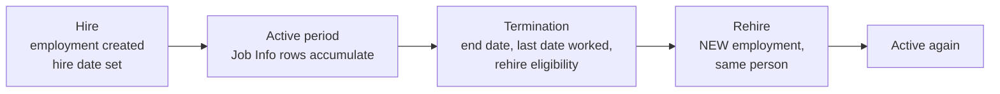

# Employment Information

## What it is

**Employment Information (`employmentInfo`)** is the record of *one working relationship* between a person and the company. It is created when someone is hired and closed when they leave. It is the parent of Job Information, Compensation Information, and everything else that is true "about this assignment".

Analogy: if Person is the passport, Employment Information is the **contract cover page** — start date, end date, and the handful of facts that describe the relationship as a whole rather than its month-to-month detail.

---

## The key fields

| Field | Meaning | Why it matters |
|---|---|---|
| **Hire date** (`start-date`) | The date this employment began | Drives the first Job Information record; used everywhere |
| **Original start date** | First ever start date with the company, across employments | Service calculations for a rehire |
| **Seniority date** | Date used for seniority/benefit entitlement | Can differ from hire date after acquisitions or rehires |
| **Service date** / anniversary date | Local variants of the above | Often derived by rule |
| **Termination date** (`end-date`) | Last day of this employment | Set by the Termination transaction |
| **Last date worked** | May differ from termination date (notice period, garden leave) | Payroll and access revocation depend on it |
| **Payroll end date** | When payroll should stop | Frequently different from termination date |
| **Is primary employment** | For concurrent employment | Determines which assignment is "the main one" for reporting |
| **Assignment ID / user ID** | The employment key | Referenced by everything downstream |
| **Employment type / assignment class** | Standard, global assignment, concurrent, contingent worker | Drives behaviour and reporting |
| **Okay to rehire / rehire eligibility** | Set at termination | Checked when a former employee reapplies |
| **Probation period end date** | Often derived by a rule from hire date | Drives alerts and confirmation processes |
| **Notice period** | Contractual notice | Used in termination processing and document generation |

Exact field availability varies by release and configuration; the ones in bold appear in practically every implementation.

---

## Employment Information vs Job Information — the distinction that gets tested

| | **Employment Information** | **Job Information** |
|---|---|---|
| Grain | One record per employment | Many effective-dated rows per employment |
| Answers | "When did this working relationship start and end?" | "What were they doing on 3 March 2024?" |
| Effective-dated | Not in the same way — it is the container, with dates as fields | Yes, fully sliced |
| Typical fields | Hire date, seniority date, termination date, primary flag | Position, job title, department, manager, FTE, event/event reason |

Say it like this in an interview: *"Employment Information is the envelope; Job Information is the sequence of letters inside it."*

---

## The lifecycle through Employment Information

- **Hire** creates the employment plus the first Job Information and Compensation Information rows.
- **Job changes** never create a new employment — only new Job Information rows.
- **Termination** closes the employment and sets the user inactive; the data stays.
- **Rehire** creates a *second* employment under the same person, and this is where `original-start-date` earns its keep.

---

## Contingent workers

EC distinguishes **employees** from **contingent workers** (contractors, agency staff, consultants). A contingent worker:

- Has an employment record with a different assignment class / worker type
- Often has **no compensation data in EC** (they are paid via a purchase order, not payroll)
- May carry a vendor, work order number and PO number
- Should be **excluded from headcount** reporting — a design point that is forgotten and then discovered at the first board report

If a customer says "we have 4,000 employees and 900 contractors", ask immediately whether contractors go into EC, and if so how they are flagged and excluded from headcount.

---

## Alternative cost distribution and other extras

Depending on configuration you may also see, at or near employment level:

- **Alternative Cost Distribution** — splitting an employee's cost across several cost centres by percentage.
- **Work Permit Info** — visa/permit type, number, validity dates; drives alerts before expiry.
- **Pension Payouts / other country-specific employment data.**

---

## Step by step — inspect and configure

1. Open an employee → **Employment Information**. Note hire date, seniority date, and whether termination fields are visible (they usually appear only after termination).
2. Admin Center → **Manage Business Configuration** → HRIS Elements → `employmentInfo`.
3. Review each field's visibility and required flag.
4. Consider adding a rule: default `seniority-date` = `start-date` on hire, so it is never blank.
5. Consider a rule to derive `probation-end-date` = hire date + 6 months, per country.
6. Permission the block: managers usually see hire date only; HR sees everything.
7. Test with a hire, then with a termination, then with a rehire.

---

## Real world example

A company acquires a smaller firm. 300 employees transfer on 1 July.

- Each gets a **new employment** in EC with hire date 1 July.
- Their **original start date** and **seniority date** are set to their original date at the acquired company, because holiday entitlement and long-service awards must respect it.
- A **business rule** at hire defaults seniority date from hire date — so migration must explicitly *override* it, or 300 people silently lose years of service.
- **Employment type** flags them for the first year so that reporting can identify the acquired population.

The interaction between a defaulting rule and a data migration is exactly the kind of thing that gets found in UAT rather than in design. Watch for it.

---

## Interview-grade Q&A

- **What is Employment Information? [HIGH]** The record of one working relationship: hire date, original start date, seniority date, termination details, primary flag and assignment type. It is the parent of Job and Compensation Information.
- **Difference between hire date, original start date and seniority date? [HIGH]** Hire date starts *this* employment; original start date is the first ever start with the company across employments; seniority date drives entitlements and may be back-dated after acquisitions or rehires.
- **Employment Information vs Job Information? [HIGH]** Employment is the container for one assignment; Job Information is the effective-dated sequence of what they did within it.
- **How are contingent workers handled? [MED]** As employments with a contingent worker type, usually without compensation data, carrying vendor/PO details, and excluded from headcount reporting.
- **What happens to Employment Information on rehire? [HIGH]** A new employment is created for the same person; original start date preserves prior service.
- **Why do last date worked and termination date differ? [MED]** Notice periods, garden leave and payroll end dates — payroll and system access are driven by different dates.
- **Where would you store "eligible for rehire"? [MED]** On Employment Information, set during termination, and checked by Recruiting when a former employee applies.

---

## Further learning

- SAP Learning — [Employee Central Core Academy](https://learning.sap.com/courses/sap-successfactors-employee-central-core-academy)
- SAP Help — [Implementing Employee Central Core](https://help.sap.com/docs/successfactors-employee-central/implementing-employee-central-core)
- Video — [EC employee data](https://www.youtube.com/watch?v=6xrD8Vkm0QI)
