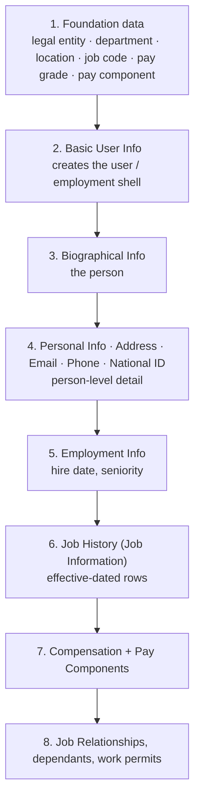

# Employee data imports

Every EC project loads its people through **Admin Center → Import Employee Data**. Interviewers ask about it because it exposes whether you understand the data model: the import sequence *is* the data model, expressed as files.

---

## The golden rule: order matters

You cannot load a job record for a person who does not exist, or a department that has not been created. The dependency chain:

If a load fails, the usual cause is that something earlier in the chain is missing — not that the file is malformed.

---

## The main templates

| Template | Level | Keys on | Holds |
|---|---|---|---|
| **Basic User Info / Basic Import** | User | `USERID` | Username, status, locale, basic suite fields |
| **Biographical Information** | Person | `person_id_external` | Date of birth, gender, place of birth |
| **Personal Information** | Person, effective-dated | `person_id_external` + start date | Name, marital status |
| **Address / Home Address** | Person, effective-dated | person + address type + start date | Address fields per country |
| **Email / Phone** | Person | person + type | Contact details |
| **National ID** | Person | person + country + card type | ID numbers |
| **Employment Details** | Employment | `user_id` / assignment | Hire date, original start date, seniority |
| **Job History (Job Information)** | Employment, effective-dated | user + start date | Full job row, including event and event reason |
| **Compensation Information** | Employment, effective-dated | user + start date | Pay group, grade, currency |
| **Recurring / Non-Recurring Pay Components** | Employment, effective-dated | user + component + start date | Amounts |
| **Job Relationships** | Employment, effective-dated | user + relationship type + start date | Related person |

Always **download the template from the instance you are loading into**. Templates change with releases and with configuration — a template from a different tenant will have the wrong columns.

---

## How to run an import

1. Admin Center → **Import Employee Data**.
2. Select the import type. **Download the blank template** (and, useful trick, download the *current data* for that entity to see real, valid values).
3. Fill the file. Keep it as **UTF-8 CSV**; check date format matches the instance setting (commonly `MM/DD/YYYY` or `DD/MM/YYYY` — get this wrong and the whole file fails or, worse, half-succeeds with wrong dates).
4. Choose the import mode:
   - **Full purge / Full import** — replaces existing data. Dangerous; use only for initial loads.
   - **Incremental / Delta** — adds or updates the rows in the file. The normal choice.
5. **Validate first.** Most import screens allow a validation-only run. Always do it.
6. Run the import; choose whether to run business rules and workflows during import (usually **off** for migration, **on** for ongoing loads — see below).
7. Read the **result file**. It lists the failed rows with reasons. A "successful" import with 400 failures is not a successful import.
8. Spot-check in the UI: open three or four records and confirm history looks right.

---

## Rules and workflows during import

A crucial choice with no universally right answer:

| | **Rules/workflows ON** | **Rules/workflows OFF** |
|---|---|---|
| Effect | Defaults, validations and approvals behave as in the UI | Data is written as supplied |
| Use for | Ongoing loads where the data must obey business logic | Initial migration where the legacy data is authoritative |
| Risk | A defaulting rule silently overwrites migrated values (e.g. seniority date) | Data that would fail validation gets in |

The classic migration bug: a rule defaults `seniority-date` from `hire-date`, so 300 transferred employees lose their prior service — as described in [Employment Information](05_Employment_Information.md).

---

## Why imports fail — the checklist

1. **Missing prerequisite** — the person, the employment, the department, the pay component does not exist.
2. **Date format mismatch** with the instance/locale setting.
3. **Invalid picklist value** — the file has "Full Time", the picklist has `FULL_TIME`. Import matches on the **external code**, not the label.
4. **Effective date earlier than the hire date** — EC will not accept job data before the employment starts.
5. **Duplicate effective dates** on the same element for the same person.
6. **Association violation** — the department does not belong to the business unit given.
7. **Missing mandatory field** that is required by the data model or by a validation rule.
8. **Wrong key column** — person key used where a user key is expected.
9. **Permissions** — the importing user lacks permission on a field, so it is silently ignored.
10. **File encoding** — non-UTF-8 files mangle accented names and then fail uniqueness checks.

Work down that list in order and you will resolve most failures without help.

---

## Migration strategy — the practical shape

1. **Extract** from the legacy system, per entity.
2. **Map** to EC templates in a mapping workbook — this is the deliverable, not the files.
3. **Cleanse** — legacy data always contains people with no manager, jobs with no code, and salaries in the wrong currency. Cleanse in the source or in the mapping, never by hand in the final file.
4. **Mock load 1** into DEV with a subset. Measure failures, fix the mapping.
5. **Mock load 2** into TEST with the full volume. Time it — a 40,000-employee load is a cutover-window question.
6. **Reconcile**: counts per entity, totals for salary, spot checks. Sign off by the customer.
7. **Mock load 3 / dress rehearsal** with the real cutover script and timings.
8. **Go-live load**, then reconcile again before opening the system to users.

**How much history to load** is a decision, not a default. Loading five years of Job Information history is expensive and slow; loading only the current row loses reporting. Common compromise: current row plus the hire row, plus whatever a specific legal requirement demands.

---

## Real world example

A 14,000-employee migration from a legacy HR system:

- 11 templates, loaded in dependency order, scripted so the whole sequence runs unattended in about four hours.
- Rules switched **off**; validations replicated in the mapping tool so bad data was caught before the file was built.
- Two mock loads found: a date-format problem (fixed once), 340 employees with managers who were not being migrated (fixed by loading a placeholder manager then correcting), and 26 duplicate national IDs (genuine legacy duplicates, resolved by HR).
- Reconciliation: headcount by legal entity, total annual salary by pay group, and a random sample of 50 records checked field by field.
- The go-live load itself was uneventful — which is what three rehearsals buys you.

---

## Interview-grade Q&A

- **What order do you load employee data in? [HIGH]** Foundation data, then Basic User Info, Biographical, Personal/Address/Contact/National ID, Employment Info, Job History, Compensation and pay components, then relationships and other extras.
- **Why does order matter? [HIGH]** Each level references the one above; you cannot create job data for a non-existent employment, or point at a department that has not been created.
- **Full vs incremental import? [HIGH]** Full purge replaces the data set and is used only for initial loads; incremental adds/updates the rows in the file and is the normal mode.
- **Should business rules run during a migration load? [HIGH]** Usually off, so migrated values are not overwritten by defaulting rules — but then validations must be enforced in the mapping instead.
- **Give five reasons an import fails. [HIGH]** Missing prerequisite record, date format mismatch, invalid picklist external code, effective date before hire date, duplicate effective dates, association violation, missing mandatory field.
- **How do you match picklist values on import? [MED]** By external code, not by label.
- **How much history would you migrate? [MED]** A business decision balancing reporting need, legal requirement, load time and cost — commonly the current record plus hire, unless there is a specific requirement for more.
- **How do you prove a migration worked? [HIGH]** Reconciliation: record counts per entity, control totals (headcount by legal entity, salary totals by pay group), and a signed-off sample of field-by-field checks.

---

## Further learning

- SAP Learning — [Employee Central Core Academy](https://learning.sap.com/courses/sap-successfactors-employee-central-core-academy)
- SAP Help — [Implementing Employee Central Core](https://help.sap.com/docs/successfactors-employee-central/implementing-employee-central-core)
- Video — [Employee data and imports](https://www.youtube.com/watch?v=qkmFdj4h4rA)
