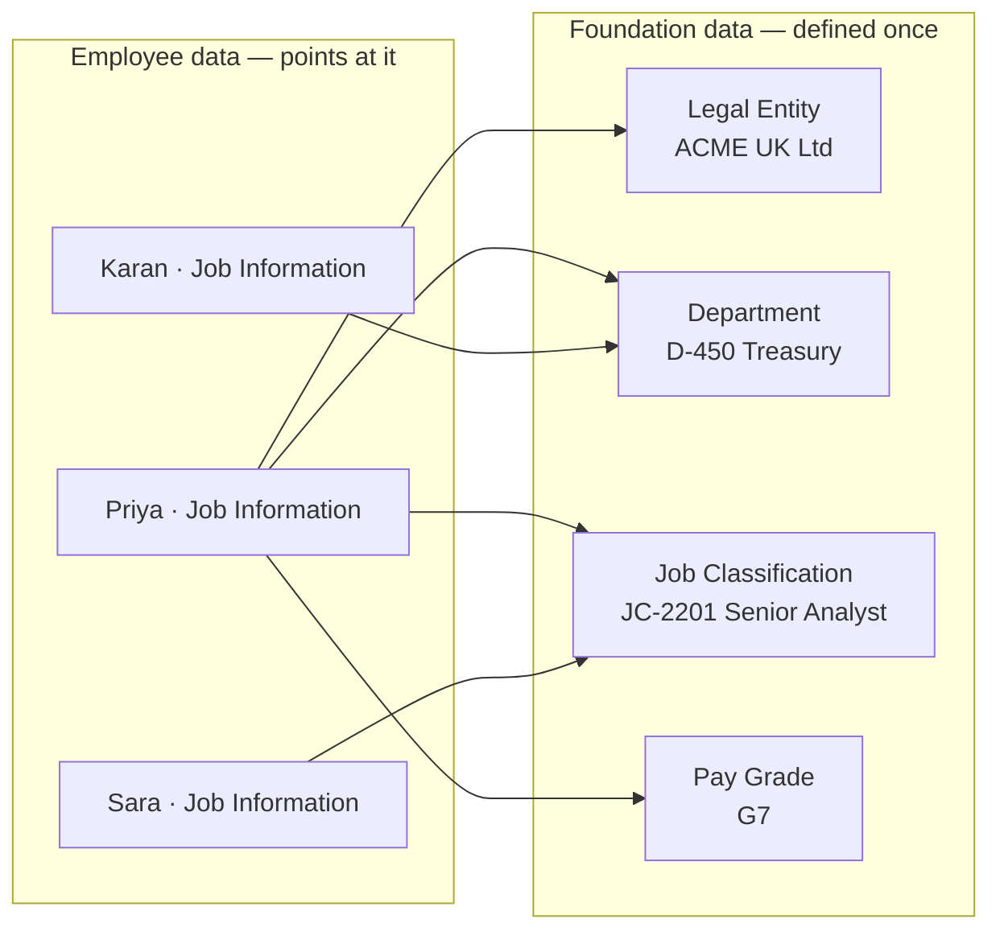

# What are Foundation Objects?

## Plain definition

A **Foundation Object (FO)** is a piece of **shared, reusable structural data** that many employee records point at: a legal entity, a department, a job code, a pay grade, a location.

Analogy: a library. Every borrower's record says *"currently has book #4471"*. The **book catalogue** — title, author, shelf, publisher — is stored once, not copied into every borrower's card. Foundation Objects are the catalogue; employee data holds the pointers.

---

## Why they exist — four reasons

1. **Consistency.** "Treasury" is spelled one way, by everybody, forever. Free-text department names destroy reporting within a month.
2. **Maintainability.** Rename a department once and 400 employee records follow. If the name were copied into each record, you would need a mass update.
3. **Derivation.** An FO can carry defaults that flow into employee data — the department knows its cost centre, the job code knows its pay grade. This is **propagation**, covered in [file 05](05_Associations_and_Propagation.md).
4. **Validation.** Associations between FOs mean the system can refuse invalid combinations: a UK department cannot be picked for a German legal entity if you have modelled it that way.

**The rule that follows from this:** if a value is *about the organisation*, it belongs in a Foundation Object. If it is *about the person*, it belongs in employee data. Never store a department name as text on Job Information.

---

## MDF Foundation Objects vs legacy Foundation Objects

This is the historically messy part, and interviewers ask about it precisely because it shows whether you have worked in a real instance.

Originally, all FOs were defined in the **Corporate Data Model (CDM)** XML and maintained in a tool called **Manage Organization, Pay and Job Structures**. Over several releases SAP migrated most of them to the **Metadata Framework (MDF)**, where they became ordinary Generic Objects — defined in *Configure Object Definitions* and maintained in *Manage Data*.

| | **MDF Foundation Objects** | **Legacy Foundation Objects** |
|---|---|---|
| Defined in | Configure Object Definitions (MDF) | Corporate Data Model XML |
| Maintained in | **Manage Data** | **Manage Organization, Pay and Job Structures** |
| Extend with custom fields | Yes, freely | Limited, via the CDM XML |
| Effective-dated | Yes | Varies |
| Rules attachable | Yes | Limited |
| Imported via | Import and Export Data (MDF) | Import Foundation Data |

**Typically MDF-based today:** Legal Entity (Company), Business Unit, Division, Department, Cost Centre, Location, Location Group, Geozone, Job Function, Job Classification, Pay Grade, Pay Range, Pay Group, Position, Workflow Configuration.

**Typically still legacy:** Pay Component, Pay Component Group, Frequency, Event Reason, Dynamic Role — maintained in *Manage Organization, Pay and Job Structures*.

> **Verify this in your instance.** Which objects are MDF-based has moved release by release and depends on when the customer implemented and whether they ran the migration. The reliable test: search **Manage Data** for the object. If it appears there, it is MDF. If it only appears in *Manage Organization, Pay and Job Structures*, it is legacy.

Saying exactly that sentence in an interview is a strong answer — it shows you know the landscape shifts and how to check, rather than reciting a list that may be out of date.

---

## The full catalogue at a glance

| Group | Objects | Covered in |
|---|---|---|
| **Organisation** | Legal Entity / Company, Business Unit, Division, Department, Cost Centre, Location, Location Group, Geozone | [file 02](02_Organizational_Structure_FOs.md) |
| **Job** | Job Function, Job Classification, Job Family | [file 03](03_Job_Structure_FOs.md) |
| **Pay** | Pay Grade, Pay Range, Pay Group, Pay Component, Pay Component Group, Frequency | [file 04](04_Pay_Structure_FOs.md) |
| **Process** | Event Reason, Workflow Configuration, Dynamic Role | [Transactions](../07_Transactions_and_Workflows/01_Events_and_Event_Reasons.md) |
| **Position** | Position | [Position Management](../09_Position_Management/02_Position_Object_and_Configuration.md) |

---

## Common attributes every FO has

Whichever object you open, expect to find:

| Attribute | Meaning |
|---|---|
| **External code** | The stable key — what imports, associations and integrations match on. **Never change it after go-live.** |
| **Name / description** | The display label, translatable |
| **Effective start date** | FOs are effective-dated: a department can be renamed or restructured from a date |
| **Status** | Active / Inactive — you deactivate, you do not delete |
| **Parent / associations** | Links to other FOs (department → business unit, location → geozone) |
| **Custom fields** | Anything the customer needs (MDF objects only, freely) |

Two habits that separate good consultants from bad ones:

- **Design the external code convention before creating anything.** `D-0450` vs `TREASURY_UK` vs `4500001` — pick one scheme, document it, and make it meaningful to the people who will read integration files at 3am.
- **Never delete, always inactivate.** Historical employee records point at old FOs. Deleting one orphans history and breaks reports.

---

## Foundation Objects are effective-dated too

People remember that employee data is effective-dated and forget that FOs are.

- Renaming Department D-450 from "Treasury" to "Group Treasury" from 1 January creates a new time slice on the FO.
- A report as of last year shows "Treasury"; as of today it shows "Group Treasury".
- Reorganising — moving a department from one business unit to another — is an effective-dated change on the department, not a mass employee update.

That last point is a genuinely useful thing to know: **a lot of "re-org" work is FO work, not employee work.**

---

## Real world example

A customer describes their organisation in a workshop:

> *"We have three legal entities. Under those we have four business units. Each business unit has divisions, and departments sit under divisions. Cost centres come from Finance and don't match departments one-to-one. We have 38 offices in 9 countries."*

That translates directly:

| Statement | Object |
|---|---|
| Three legal entities | **Legal Entity** ×3 |
| Four business units | **Business Unit** ×4, each associated to legal entities |
| Divisions under business units | **Division**, associated to Business Unit |
| Departments under divisions | **Department**, associated to Division |
| Cost centres from Finance | **Cost Centre**, loaded from the ERP, associated where useful |
| 38 offices | **Location** ×38, associated to Legal Entity and grouped by **Geozone** |

Notice the one that needed a follow-up question: *"cost centres don't match departments one-to-one"* — so cost centre cannot simply be propagated from department for everyone, and you need a rule plus an override, or alternative cost distribution. Spotting that in the workshop is the job.

---

## Common mistakes

- **Storing structure as free text** on Job Information because "the customer only has five departments". They will have fifty next year.
- **Modelling every level the customer names.** If Division adds no reporting value and nobody maintains it, do not create it — every level is a maintenance cost.
- **Changing an external code after go-live.** Integrations, reports and history all break.
- **Deleting an FO** instead of inactivating it.
- **Building the job catalogue from job *titles*.** 4,000 titles become 4,000 job codes, and the catalogue is useless. See [file 03](03_Job_Structure_FOs.md).
- **Forgetting FOs are effective-dated**, then doing a re-org by mass-updating employees.

---

## Interview-grade Q&A

- **What is a Foundation Object? [HIGH]** Shared structural data (legal entity, department, job code, pay grade, location) that employee records point at, so structure is defined once and reused.
- **Why not store the department name on the employee record? [HIGH]** Consistency, maintainability, derivation and validation — and because a rename would otherwise require a mass update of every employee.
- **MDF FOs vs legacy FOs? [HIGH]** Most FOs were migrated to MDF and are maintained in Manage Data with full extensibility; a residual set (typically Pay Component, Pay Component Group, Frequency, Event Reason, Dynamic Role) is still defined in the Corporate Data Model and maintained in Manage Organization, Pay and Job Structures. Which is which varies by release — check whether the object appears in Manage Data.
- **Are Foundation Objects effective-dated? [HIGH]** Yes. Renames and restructures are effective-dated changes on the object itself.
- **What is an external code and why does it matter? [HIGH]** The stable key used by associations, imports, integrations and reports. It must be designed up front and never changed after go-live.
- **How do you retire a department? [MED]** Set it inactive with an effective date; never delete, because historical employee records reference it.
- **Which comes first in a build — foundation data or employee data? [HIGH]** Foundation data, always. You cannot hire into structures that do not exist.

---

## Further learning

- SAP Learning — [Employee Central Core Academy](https://learning.sap.com/courses/sap-successfactors-employee-central-core-academy) — Configuring foundation objects
- SAP Help — [Implementing Employee Central Core](https://help.sap.com/docs/successfactors-employee-central/implementing-employee-central-core)
- Video — [Foundation objects walkthrough](https://www.youtube.com/watch?v=yEsquQA-MxU)
