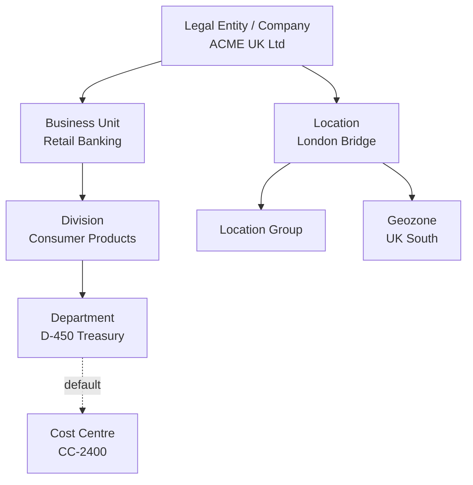

# Organisational structure Foundation Objects

The objects that answer *"where in the company does this person sit, and who pays for them?"*

---

## The standard hierarchy

Solid lines are hierarchy/associations; the dotted line is a typical **propagation** (department defaults the cost centre).

**Important:** this is the *typical* design, not a law. EC does not force Business Unit above Division above Department. You choose which levels exist and how they associate. That freedom is the design work.

---

## Legal Entity (Company)

**The legal employer.** Usually the most important FO in the model, because so much hangs off it.

| Key attribute | Why it matters |
|---|---|
| **Country/Region** | Determines which **country-specific fields** appear on the employee's records, which address format applies, which national ID types are valid |
| Default currency | Feeds compensation |
| Standard hours / working days | Often the default for FTE calculations |
| Legal identifiers | Company registration number, tax numbers, used by payroll and documents |
| Header/footer, letterhead | Used by Document Generation |
| Time zone | Affects Time Off and notifications |

**Design rule:** create one legal entity per legal employing entity — not one per country, and not one per business. If ACME operates in Germany through two GmbHs, that is two legal entities. If it operates in Spain through a branch of the UK entity, that may be one legal entity with a Spanish location, or two — ask the payroll and legal teams, do not assume.

**Consequences of getting it wrong:** country-specific fields appear for the wrong people, payroll routing is wrong, and moving employees between entities becomes a re-hire when it should not be.

---

## Business Unit and Division

Two optional-but-common levels between the legal entity and the department.

- **Business Unit** — the top-level business grouping ("Retail Banking", "Manufacturing", "Corporate Functions").
- **Division** — the next level down.

Both are simply **grouping and reporting levels**. Neither is required by EC. The questions to ask:

1. Does anyone need to **report** at this level?
2. Will anyone **maintain** it accurately?
3. Does it drive **permissions**, workflow routing or eligibility?

If the answer to all three is no, do not create the level. Every unnecessary level is a field on Job Information that someone must fill in correctly forever.

**A common trap:** the customer says "we have business units", meaning something informal that changes every reorganisation. Model the stable structure; use a custom field or a report grouping for the volatile one.

---

## Department

The level most users actually recognise, and usually the most-used field on Job Information.

| Attribute | Notes |
|---|---|
| External code | Design the convention; departments outlive reorganisations |
| Name | Translatable |
| Association to Division / Business Unit / Legal Entity | Constrains valid combinations |
| **Cost centre** | Very commonly propagated to Job Information |
| Head of department | Sometimes a person or position reference |
| Custom fields | Whatever the customer needs |

**Department vs the position hierarchy** is one of the recurring design questions in EC. Two valid patterns:

| Pattern | Department is… | Used when |
|---|---|---|
| **Department as the org unit** | The formal organisational structure; the manager hierarchy runs separately | No Position Management, or positions used only for headcount |
| **Position hierarchy as the org** | Department is more of a reporting attribute | Position Management is fully implemented |

Mixing them inconsistently — some areas managed by department, some by position — is the single most common source of "our org chart is wrong" tickets.

---

## Cost Centre

**Who pays for the employee.** Often the FO with the strongest external dependency, because it usually comes from Finance.

- Frequently **replicated from SAP ERP/S4 Finance** rather than maintained in EC. If so, EC is not the master — do not let anyone create cost centres by hand.
- Departments and cost centres are **not always one-to-one**. Ask early.
- **Alternative Cost Distribution** allows one employee's cost to be split across several cost centres by percentage — used for shared services and project-funded roles.
- Cost centre is usually **propagated from department by default with an override allowed**, implemented as a rule or as propagation.

Interview-worthy nuance: cost centre changes are financially sensitive and often need their own approval workflow even when the rest of the job change does not.

---

## Location, Location Group and Geozone

| Object | What it is | Typical use |
|---|---|---|
| **Location** | A physical place of work — an office, plant, store, or "Remote — UK" | Address, time zone, holiday calendar, work schedule defaults, tax jurisdiction in some countries |
| **Location Group** | A grouping of locations | Reporting; sometimes eligibility rules |
| **Geozone** | A compensation geography | **Pay ranges** are usually defined per geozone — "London" vs "UK Regions" |

Design points:

- **Remote workers need a location.** Create explicit "Remote" locations per country rather than leaving the field blank, or every downstream calculation that depends on location breaks.
- **Location drives holiday calendars** if Time Off is implemented — so the location list must match the calendar list.
- **Geozone is about pay, not geography.** Two locations 5 km apart can be in different geozones if the market rates differ, and locations in different countries can share a geozone if they share a currency and market.

---

## Putting it together — a worked design

Requirement from a workshop:

> *"We're a UK and Ireland retailer. One UK company, one Irish company. Stores, distribution centres and a head office. Store staff are paid on national rates except London, which has a premium. Finance wants cost by store."*

Design:

| Object | Instances |
|---|---|
| Legal Entity | `UK01` ACME Retail Ltd (GB), `IE01` ACME Retail Ireland Ltd (IE) |
| Business Unit | `RETAIL`, `LOGISTICS`, `SUPPORT` |
| Division | Not created — no reporting need, nobody would maintain it |
| Department | Head-office departments only (`D-FIN`, `D-HR`, `D-IT`…); stores use Location + Position |
| Location | One per store, DC and office (≈ 240) |
| Cost Centre | One per store (from Finance), plus head-office cost centres |
| Geozone | `UK-LONDON`, `UK-NATIONAL`, `IE-NATIONAL` |

Two decisions worth noticing:

1. **Division was dropped** because it failed the "who maintains it?" test.
2. **Stores are Locations, not Departments** — because store staff report by position within a store, and Finance wants cost by store, which the Location→Cost Centre mapping already gives. Forcing 240 stores into the Department field as well would have doubled the maintenance for no benefit.

---

## Step by step — create the organisational structure

1. **Design on paper first.** Draw the objects and the associations. Get the customer to sign it.
2. **Agree the external code convention** and write it in the workbook.
3. Admin Center → **Manage Data** → *Create New* → **Legal Entity**. Fill external code, name, country, currency, effective start date.
4. Repeat for **Business Unit**, then **Division**, then **Department** — parents before children, always.
5. On each child, set the **association** to its parent (Department → Division, and so on).
6. Create **Cost Centres** (or configure the Finance replication).
7. Create **Locations**, associating each to its Legal Entity and **Geozone**.
8. Configure **propagation** so Department propagates its Cost Centre to Job Information — see [file 05](05_Associations_and_Propagation.md).
9. In **Manage Business Configuration**, confirm the corresponding Job Information fields are visible and correctly labelled.
10. **Test** by hiring a dummy employee: pick a legal entity, and confirm the department picklist filters correctly and the cost centre populates itself.
11. For volume, switch to **Import and Export Data** rather than creating by hand.

---

## Common mistakes

- Creating **too many levels** because the customer named them in a slide.
- **Legal Entity per country** when the legal reality is different — this drives country-specific data and payroll, so it must be legally accurate.
- Leaving **Location blank** for remote workers.
- Treating **Geozone as geography** and defining one per country, then discovering London and Manchester need different pay ranges.
- Letting users create **Cost Centres** when Finance is the master.
- Building the hierarchy **children-first**, so associations cannot be set.

---

## Interview-grade Q&A

- **Name the organisational Foundation Objects. [HIGH]** Legal Entity/Company, Business Unit, Division, Department, Cost Centre, Location, Location Group, Geozone.
- **What does the Legal Entity drive? [HIGH]** Country — and therefore country-specific fields, address format, national ID types — plus currency, standard hours, legal identifiers, payroll routing and document letterhead.
- **Are Business Unit and Division mandatory? [HIGH]** No. They are optional grouping levels; create them only if someone reports on them, maintains them, or drives permissions with them.
- **What is a Geozone for? [HIGH]** Grouping locations for compensation — pay ranges are defined per geozone and currency.
- **How is the cost centre normally populated? [HIGH]** Propagated or derived from the department by default, with an override where Finance requires it; often replicated from the ERP as master data.
- **What is Alternative Cost Distribution? [MED]** Splitting one employee's cost across multiple cost centres by percentage.
- **Department or position hierarchy — which is the org structure? [HIGH]** A design decision. Department-based where Position Management is not used; position-hierarchy-based where it is. Mixing the two inconsistently is what breaks org charts.
- **Where do you put remote workers? [MED]** An explicit "Remote — country" location, never a blank location field.

---

## Further learning

- SAP Learning — [Employee Central Core Academy](https://learning.sap.com/courses/sap-successfactors-employee-central-core-academy) — Configuring foundation objects
- Video — [Foundation objects: organisation](https://www.youtube.com/watch?v=yEsquQA-MxU)
