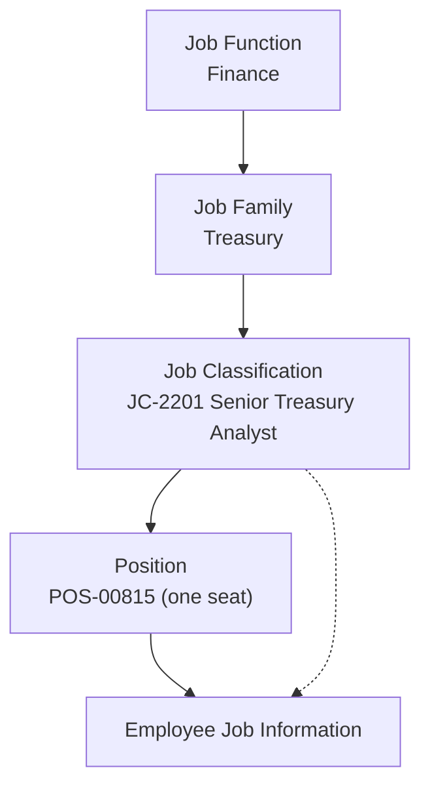

# Job structure Foundation Objects

The objects that answer *"what job is this, and how does it relate to other jobs?"*

---

## The three objects

| Object | What it is | Grain |
|---|---|---|
| **Job Function** | The broadest grouping — Finance, IT, Sales, Operations | A handful to a few dozen |
| **Job Family** | A career grouping within a function — Treasury, Financial Reporting, Tax | Tens |
| **Job Classification** (job code) | **The actual job** — "Senior Treasury Analyst" | Hundreds |
| **Position** | One *seat* of that job in one part of the org | Thousands — see [Position Management](../09_Position_Management/01_Position_Management_Fundamentals.md) |

The distinction that matters: **a Job Classification is a kind of job; a Position is one instance of it.** "Senior Treasury Analyst" is a job classification; "the Senior Treasury Analyst seat in the London Treasury team, currently held by Priya" is a position.

---

## Job Classification — the important one

This is the object Job Information points at, and the one every catalogue conversation is really about.

| Attribute | Typical use |
|---|---|
| **External code** | The job code — used by every downstream system |
| **Name / title** | Often propagated into the employee's Job Title |
| **Job Function / Job Family** | Association for grouping and career paths |
| **Pay Grade** | Very commonly **propagated** — pick the job, get the grade |
| **Job Level / Career Level** | Grade-like banding for talent processes |
| **FLSA status / exempt-non-exempt** | US requirement, drives overtime rules |
| **Regular/Temporary defaults, standard hours** | Defaults for Job Information |
| **Is manager / supervisory flag** | Used by some rules and reports |
| **Job description text** | Used by Recruiting and Document Generation |
| **Country / legal entity applicability** | If the catalogue differs per country |

**Propagation from Job Classification is one of the highest-value configurations in EC**: the user selects the job, and pay grade, job title, FLSA status and standard hours all populate themselves. That is fewer fields to fill and far fewer data-quality defects.

---

## Designing a job catalogue — the real work

This is a consulting problem, not a clicking problem. The customer usually arrives with a spreadsheet of **job titles** — 4,300 of them, because everyone's business card is different.

**The rule: job classifications are jobs, not titles.**

| Job titles (what people call themselves) | Job classification (what the job is) |
|---|---|
| Senior Analyst, Treasury | |
| Treasury Analyst II | → `JC-2201` Senior Treasury Analyst |
| Sr. Analyst — Cash Management | |

Three approaches, in order of preference:

1. **Adopt an existing framework.** Many customers already have a job architecture from a compensation exercise (Mercer, WTW, Korn Ferry levels). Use it — it is already agreed and benchmarked.
2. **Build from the pay structure.** If jobs map to grades, derive the catalogue from grades × families.
3. **Rationalise from titles.** Longest and most painful; group titles into jobs with HR and the business, function by function.

**Rules of thumb**

- A catalogue of **200–800 job classifications** is normal for a 10,000-employee company. If you have 4,000, you have titles, not jobs.
- **Job Title as a separate free-text field** on Job Information is the usual compromise: the job code drives reporting and pay; the title keeps the business happy. Default the title from the job code by rule and allow an override — but tell the customer, explicitly, that reporting must use the job code.
- **Do not encode the organisation in the job code.** `JC-FIN-LONDON-SNR-ANALYST` is a job code that breaks the day someone does that job in Manchester.
- **Do not encode the level in the name only.** If levels matter, make them a field.

---

## Job Function and Job Family

Both are grouping objects. They earn their place when they drive something:

- **Career paths** — "which jobs can a Treasury Analyst move into?" requires families.
- **Talent and succession** — talent pools are often defined by family.
- **Compensation benchmarking** — market data is bought by family and level.
- **Reporting** — headcount by function is a standard board metric.
- **Recruiting** — requisition templates and approval routing by function.

If none of those apply, one grouping level is enough. Two levels that nobody uses is two levels somebody has to maintain.

---

## How the job structure reaches the employee

Three routes, and you should be able to explain all three:

1. **Direct** — the user picks a Job Classification on Job Information.
2. **Via Position** — the user picks a Position; the position carries the Job Classification, which flows into Job Information. This is the norm where Position Management is on.
3. **By rule** — a business rule derives or validates the job classification (rare for the job itself, common for its dependants such as pay grade).

---

## Worked example

A manufacturer, 6,000 employees, arriving with 1,900 job titles.

**Workshop findings:**
- Compensation already uses a 12-level global grade structure.
- Recruiting wants requisition routing by function.
- Production roles are highly standardised; office roles are not.

**Design:**

| Object | Count | Notes |
|---|---|---|
| Job Function | 9 | Production, Engineering, Quality, Supply Chain, Finance, HR, IT, Sales, Admin |
| Job Family | 41 | Only where a career path or benchmark exists |
| Job Classification | 380 | Built from grade × family, validated function by function with HR |
| Job Title (field) | free text, defaulted from job code | The 1,900 titles survive as titles |

**Configuration:**
- Job Classification propagates **Pay Grade**, **FLSA status** and **standard hours** into Job Information.
- A business rule defaults **Job Title** from the job classification name; managers may override.
- A validation rule blocks a job classification whose pay grade does not match the entered pay grade unless the user holds an HR role.

**Outcome:** the user picks one field (or a position) and four fields populate correctly. That is what a good job structure buys you.

---

## Step by step — build it

1. Agree the **catalogue design** and external-code convention with the customer, in writing.
2. **Manage Data** → create **Job Functions** (parents first).
3. Create **Job Families**, associating each to a function.
4. Create **Job Classifications**, associating each to a family, and set the propagating attributes (pay grade, FLSA, standard hours, job level).
5. For volume, build a CSV and use **Import and Export Data** — nobody hand-creates 380 jobs.
6. Configure **propagation** from Job Classification to Job Information fields.
7. Configure **field criteria** so the Job Classification picklist filters by Job Function (or by legal entity/country) — otherwise the user scrolls through 380 entries.
8. Add a rule to default **Job Title**.
9. Test: hire a dummy employee, pick a job, and confirm the derived fields populate and the filters work.
10. Export the objects and keep them with the configuration workbook.

---

## Common mistakes

- **Job code = job title.** The defining error of job-catalogue design.
- **No filtering** on the Job Classification picklist, so users pick the wrong job because they gave up scrolling.
- **Encoding organisation, location or level into the external code**, making the code unusable after any change.
- **Creating job families nobody uses**, then discovering nobody maintains them either.
- **Changing job codes after go-live** to "tidy them up" — breaking every historical report and integration.
- **Ignoring country differences** where the same job is legally different (FLSA in the US, collective-agreement classifications in Germany or France).

---

## Interview-grade Q&A

- **Difference between Job Classification and Position? [HIGH]** A job classification is a *kind of job* in the catalogue; a position is a single *seat* of that job in a specific part of the organisation, held by at most one incumbent (unless multi-incumbent is allowed).
- **What are Job Function and Job Family for? [HIGH]** Grouping job classifications for career paths, talent pools, compensation benchmarking, reporting and recruiting routing.
- **A customer gives you 4,000 job titles. What do you do? [HIGH]** Explain that titles are not jobs; rationalise into a catalogue of a few hundred job classifications — ideally reusing an existing job architecture from compensation — and keep job title as a separate, defaulted, overridable field.
- **What does a Job Classification typically propagate? [HIGH]** Pay grade, job title, FLSA/exempt status, standard hours, job level.
- **How do you stop users picking the wrong job code? [MED]** Field criteria filtering the picklist by function, country or legal entity, plus validation rules.
- **Should the job title be free text? [MED]** A compromise: default it from the job classification, allow override where the business insists, and make clear that reporting uses the job code, not the title.
- **How many job classifications is reasonable? [MED]** Typically a few hundred for a mid-size company; thousands indicates titles have been mistaken for jobs.

---

## Further learning

- SAP Learning — [Employee Central Core Academy](https://learning.sap.com/courses/sap-successfactors-employee-central-core-academy) — Configuring foundation objects
- Video — [Foundation objects: job and pay structure](https://www.youtube.com/watch?v=yEsquQA-MxU)
