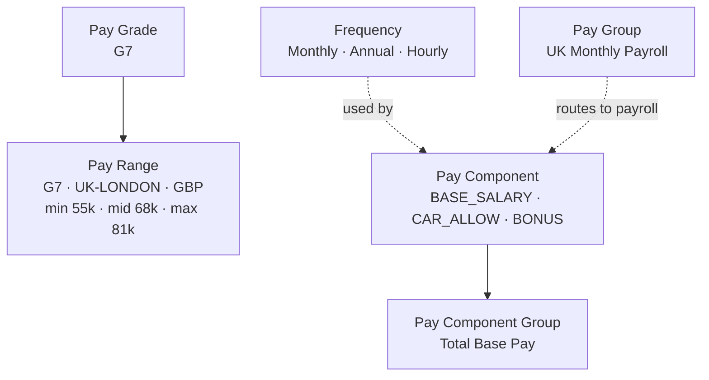

# Pay structure Foundation Objects

The objects that answer *"what is this person paid, out of which structure, and on which payroll?"*

---

## The objects

| Object | What it is | Usually |
|---|---|---|
| **Pay Grade** | A level in the salary structure | MDF |
| **Pay Range** | Min / mid / max for a grade, per geozone and currency | MDF |
| **Pay Group** | Which payroll run an employee belongs to | MDF |
| **Pay Component** | One element of pay — the equivalent of a wage type | **Legacy** (Manage Organization, Pay and Job Structures) |
| **Pay Component Group** | An aggregation of components for totals | **Legacy** |
| **Frequency** | Monthly, annual, weekly, hourly — with a factor | **Legacy** |

> Verify the MDF/legacy split in your own instance: if the object appears in **Manage Data** it is MDF; if it only appears in **Manage Organization, Pay and Job Structures** it is legacy.

---

## Pay Grade

A level: `G1`…`G12`, or `PROF-3`, or "Senior Professional".

| Attribute | Notes |
|---|---|
| External code | Stable key |
| Name | Translatable |
| Legal entity / country applicability | Where structures differ by country |
| Job level mapping | Links the pay structure to the job structure |

Pay grade is almost always **propagated from Job Classification** — the user picks the job, the grade appears. Letting users type a grade freely is how you end up with a Senior Analyst on G3.

---

## Pay Range

The money. **Min, mid and max for one grade, in one geozone, in one currency, for a period.**

| Attribute | Example |
|---|---|
| Pay Grade | `G7` |
| Geozone | `UK-LONDON` |
| Currency | `GBP` |
| Frequency | Annual |
| Min / Mid / Max | 55,000 / 68,000 / 81,000 |
| Effective dates | Ranges are re-set every year |

Three things people get wrong:

1. **Ranges are per geozone.** One range per grade globally is meaningless — London and Warsaw are different markets. This is what [Geozone](02_Organizational_Structure_FOs.md) exists for.
2. **Ranges are effective-dated and change annually.** Loading this year's ranges over last year's, rather than as a new time slice, destroys the ability to report last year's compa-ratio.
3. **Currency matters.** A range in GBP cannot be compared to a salary in EUR without conversion — which EC does not do for you in a validation rule unless you build it.

**Derived measures:** compa-ratio = salary ÷ mid; range penetration = (salary − min) ÷ (max − min). Both feed Compensation planning and both depend entirely on this object being right.

---

## Pay Component

**The single most important pay object.** One element of pay — the EC equivalent of an SAP HCM **wage type**.

| Attribute | Meaning |
|---|---|
| **Code / external code** | `BASE_SALARY`, `CAR_ALLOW`, `SHIFT_PREM`, `BONUS_ANN` |
| **Type** | Recurring or non-recurring |
| **Value type** | Amount, percentage, or number |
| **Currency** | Fixed, or the employee's currency |
| **Frequency** | Monthly / annual / hourly — determines annualisation |
| **Included in totals** | Whether it counts toward Total Base Pay, target pay, annualised salary |
| **Payroll mapping** | The wage type it maps to in the payroll system |
| **Is target / is variable** | Used by Compensation and Variable Pay |

**Design rules**

- **One pay component per distinct payroll treatment.** If two allowances are taxed differently or map to different wage types, they are two components — even if HR calls them the same thing.
- **Agree the payroll mapping when you create the component, not later.** A component with no wage type mapping is invisible to payroll, and that defect is found in parallel payroll testing at the worst possible time.
- **Percentage components** calculate from a base — check what base, and check it survives an FTE change.
- **Keep the list short.** Every component is a mapping, a test case and a training item.

---

## Pay Component Group

An aggregation used for display and calculation:

| Group | Contains |
|---|---|
| Total Base Pay | Base salary + shift premium |
| Total Target Cash | Total base pay + target bonus |
| Total Fixed Allowances | Car + housing + travel |

Used on screens, in Compensation planning, and in reports. They calculate; they are not entered.

---

## Frequency

Small object, large consequences. Defines how often something is paid and the **factor used to annualise it**:

| Frequency | Annual factor |
|---|---|
| Annual | 1 |
| Monthly | 12 |
| Semi-monthly | 24 |
| Bi-weekly | 26 |
| Weekly | 52 |
| Hourly | (standard hours × 52) |

The annualisation convention — and whether stored amounts are full-time-equivalent or actual — must be decided once, documented, and applied consistently. See [Compensation Information](../02_Employee_Data/07_Compensation_Information.md).

---

## Pay Group

**Which payroll run the employee belongs to.** Typically one per country per pay frequency: `UK-MONTHLY`, `US-BIWEEKLY-EXEMPT`, `DE-MONTHLY`.

- Almost always **derived by rule** from legal entity + country + employee class, not typed.
- Drives **routing in the payroll replication** — the wrong pay group means the employee's data goes to the wrong payroll, or nowhere.
- Pay period calendars are usually maintained in the payroll system, not EC.

---

## Worked example

A company paying monthly-salaried staff in the UK and hourly staff in the US.

**Pay components**

| Code | Type | Value | Frequency | In Total Base? | Wage type |
|---|---|---|---|---|---|
| `BASE_SAL` | Recurring | Amount | Monthly | Yes | /0001 |
| `HOURLY_RATE` | Recurring | Amount | Hourly | Yes | /0002 |
| `SHIFT_PREM` | Recurring | Percentage of base | Monthly | Yes | /0110 |
| `CAR_ALLOW` | Recurring | Amount | Monthly | No | /0210 |
| `BONUS_ANN` | Non-recurring | Amount | — | No | /0500 |
| `SIGN_ON` | Non-recurring | Amount | — | No | /0510 |

**Pay component groups:** Total Base Pay (`BASE_SAL` + `HOURLY_RATE` + `SHIFT_PREM`); Total Target Cash (Total Base + target bonus).

**Pay grades:** `G1`–`G12` globally.

**Pay ranges:** per grade × geozone (`UK-LONDON`, `UK-NATIONAL`, `US-NE`, `US-NATIONAL`) × currency, reloaded each January as a new effective-dated slice.

**Pay groups:** `UK-MTH`, `US-BIWK-EX`, `US-BIWK-NONEX`, derived by rule from legal entity + FLSA status.

**Rules:**
- Job Classification propagates Pay Grade.
- onSave validation: base salary within the pay range for grade + geozone; error for non-HR roles, warning for HR.
- onChange of Legal Entity derives Pay Group.

---

## Step by step — build the pay structure

1. Get the **salary structure** from Compensation: grades, geozones, currencies, ranges, effective from when.
2. Get the **pay element list** from Payroll, *with the wage type mapping*. Do not start without it.
3. **Manage Organization, Pay and Job Structures** → create **Frequencies** (usually already shipped), then **Pay Components**, then **Pay Component Groups**.
4. **Manage Data** → create **Pay Grades**, then **Pay Ranges** (grade × geozone × currency, with effective dates), then **Pay Groups**.
5. Configure **propagation** from Job Classification → Pay Grade.
6. Write the **pay-range validation rule** and the **pay-group derivation rule**.
7. Configure **Compensation Information** field visibility in Manage Business Configuration.
8. **Permission** compensation blocks and pay components tightly in RBP.
9. Test: hire with a salary, promote with an increase, add a bonus, check annualisation and compa-ratio, and confirm every component appears in the payroll extract.
10. Plan the **annual range reload** as a recurring task with a new effective date — not an overwrite.

---

## Common mistakes

- **Creating a pay component without its wage type mapping**, discovered in parallel payroll.
- **One global pay range per grade**, ignoring geozones.
- **Overwriting last year's ranges** instead of inserting a new effective-dated slice.
- **Free-text pay grade** instead of propagating from the job.
- **Mixing FTE and actual amounts** across countries without documenting which is which.
- **Too many pay components** — 120 components for a company with six actual pay elements, because every legacy wage type was copied across.
- **Pay group typed by hand**, so employees land on the wrong payroll.

---

## Interview-grade Q&A

- **What is a pay component? [HIGH]** One element of pay — base salary, allowance, bonus — the EC equivalent of a wage type, defined as a foundation object and mapped to payroll.
- **Recurring vs non-recurring? [HIGH]** Recurring is paid every period and effective-dated; non-recurring is a one-off with a payment date.
- **What is a pay component group? [MED]** An aggregation of components used for totals such as Total Base Pay or Total Target Cash.
- **What is a pay range and what is it keyed by? [HIGH]** Min/mid/max for a pay grade, per geozone and currency, effective-dated — reloaded annually.
- **What is compa-ratio? [MED]** Salary ÷ pay-range midpoint.
- **Where does pay grade come from? [HIGH]** Usually propagated from the Job Classification, not typed.
- **What is a pay group and how is it set? [HIGH]** The payroll run the employee belongs to, usually derived by rule from legal entity, country and employee class; it routes the payroll replication.
- **Which pay objects are still legacy? [MED]** Typically Pay Component, Pay Component Group and Frequency, maintained in Manage Organization, Pay and Job Structures — but verify per instance and release.
- **How do you prevent an out-of-range salary? [HIGH]** An onSave rule comparing the amount to the pay range for the employee's grade and geozone, with an error or warning depending on the user's role.

---

## Further learning

- SAP Learning — [Employee Central Core Academy](https://learning.sap.com/courses/sap-successfactors-employee-central-core-academy) — Configuring foundation objects
- Video — [Foundation objects: job and pay structure](https://www.youtube.com/watch?v=yEsquQA-MxU)
