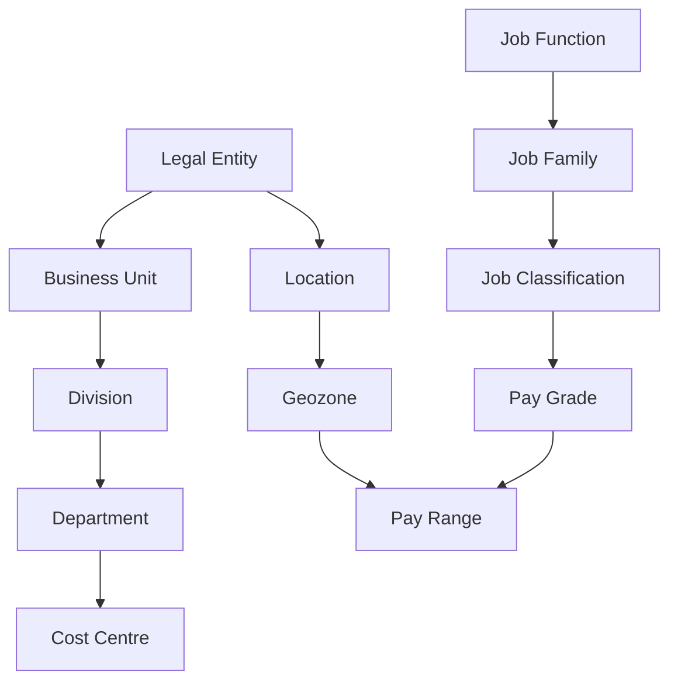

# Associations and propagation

Two mechanisms that make foundation data *useful* rather than just *present*. Interviewers ask about both, and beginners confuse them constantly.

- **Association** = a defined relationship between two objects. It **restricts what is valid**.
- **Propagation** = automatically **copying a value** from an associated object into another field.

One is about *what you may choose*. The other is about *what gets filled in for you*.

---

## Associations

### The idea

An association says "Department belongs to Division". Once declared, EC can:

- **Filter** the Department picklist to show only departments of the selected division
- **Validate** on save that the combination is legal
- **Navigate** from one record to the other in Manage Data and in reports
- **Propagate** values along the link

Analogy: a restaurant menu where choosing "Vegetarian" hides the steaks. The association is the relationship that makes the filtering possible.

### Types

| Type | Meaning | EC example |
|---|---|---|
| **One-to-one** | Each record relates to at most one record of the other object | A location has one geozone |
| **One-to-many** | One parent, many children | One Business Unit has many Divisions |
| **Many-to-many** | Records on both sides relate to several on the other | A Department valid in several Legal Entities; a Job Classification valid in several countries |

In MDF terms you will meet two flavours:

| MDF association | What it does |
|---|---|
| **Valid values association** | Restricts the values a field may take, based on another object. This is the one used for FO filtering |
| **Composite association** | Makes one object a *child* of another — the child cannot exist independently and is deleted with the parent (e.g. pay ranges as children of a grade, in some designs) |

Full MDF treatment: [MDF associations](../05_MDF/04_Associations.md).

### The typical EC association map

Every arrow is a decision. Each one you create buys filtering and validation — and costs maintenance, because someone must keep the links accurate.

### Design guidance

- **Associate where it prevents real errors.** Department → Division stops a user picking a department from another business. Worth it.
- **Do not associate everything to everything.** A many-to-many web of associations becomes impossible to maintain and produces empty picklists that nobody can explain.
- **Watch the empty-picklist failure.** The single most common association defect: the user selects a legal entity, then the Department picklist is empty, because nobody associated the departments to that entity. Test every combination the customer will actually use.
- **Associations are effective-dated too.** Moving a department to a different division on 1 January is an effective-dated change on the association.

---

## Propagation

### The idea

**Propagation copies a value from an associated foundation object into an employee data field automatically.**

Classic examples:

| User picks | Propagation fills |
|---|---|
| Department | Cost Centre |
| Job Classification | Pay Grade, Job Title, FLSA status, standard hours |
| Location | Geozone, time zone, holiday calendar |
| Legal Entity | Currency, country, standard hours |
| Position | Job Classification, Department, Location, Pay Grade, Manager |

It is configured as part of the data model / object configuration — the field says "my value comes from *this* attribute of *that* associated object".

### Propagation vs business rules

This comparison is a frequent interview question.

| | **Propagation** | **Business rule** |
|---|---|---|
| What it does | Copies an attribute from an associated object | Any logic: conditions, calculations, lookups, validations |
| Configured in | The data model / object configuration | Configure Business Rules, then attached to an element or field |
| Conditional? | No — it always copies | Yes — "if country = US then…" |
| Performance | Cheap | Costs more; many rules on one screen is a real performance topic |
| Maintainability | Very high — it is declarative | Depends on discipline |
| Use when | The value is simply an attribute of the selected object | The logic has conditions, calculations, or multiple sources |

**Rule of thumb: propagate if you can, write a rule if you must.** A rule that does nothing but copy one field is a rule someone has to debug later.

### Where propagation surprises people

1. **It fires on selection, not on save.** The user sees the value appear immediately, and can usually **overwrite** it. Propagation is a *default*, not a lock — unless you also remove edit rights or add a validation.
2. **It does not re-run retroactively.** Changing a department's cost centre does *not* update employees who already have the old value. Their Job Information holds the copied value from when it was picked. Correcting historical data is a mass update, not a propagation.
3. **Order matters on a busy screen.** If a rule also writes the same field, the last writer wins — and which is last is not always obvious. Two mechanisms writing one field is the classic "why is this field wrong?" defect.
4. **Position Management overrides the picture.** Where positions drive Job Information, values come from the position, and the synchronisation settings decide whether the user may override. See [Sync between Position and Job Info](../09_Position_Management/04_Sync_Between_Position_and_Job_Info.md).

---

## Field criteria — the third mechanism

Alongside associations and propagation, **field criteria** filter a field's values based on another field's value on the *same screen*.

- "Show only Job Classifications whose Job Function = the selected function."
- "Show only National ID card types valid for the selected country."
- "Show only Pay Ranges for the selected grade and geozone."

Associations define the relationship; field criteria apply it to a specific screen. In practice you configure both, and when a picklist shows the wrong values, you check both.

---

## Worked example — one hire, four mechanisms

A recruiter hires someone into the Treasury team in London.

| Step | Mechanism | Result |
|---|---|---|
| Picks Legal Entity `UK01` | **Association** | Department picklist filters to UK departments only |
| Picks Department `D-450 Treasury` | **Propagation** | Cost Centre `CC-2400` fills in automatically |
| Picks Location `London Bridge` | **Propagation** | Geozone `UK-LONDON` and holiday calendar fill in |
| Picks Job Classification | **Field criteria** | List filtered to Finance-function jobs |
| Job Classification selected | **Propagation** | Pay Grade `G7`, Job Title, standard hours fill in |
| Enters salary, saves | **Business rule** | Validates salary against the `G7` × `UK-LONDON` pay range |
| Save | **Business rule** | Derives Event = Hire, Event Reason = New Hire |

The recruiter typed four values. Eleven fields are correct. That is what good foundation design delivers, and it is a strong answer to "why do associations matter?"

---

## Step by step — configure an association and a propagation

**Association (MDF object, e.g. Department → Division)**

1. Admin Center → **Configure Object Definitions** → object `Department`.
2. Add an **association**: type *Valid Values*, destination object `Division`, multiplicity *One to One* (each department has one division).
3. Save the definition.
4. **Manage Data** → open a Department → set its Division. Repeat, or import in bulk.
5. Test in an employee record: pick a division, confirm the department list filters.

**Propagation (Department → Cost Centre on Job Information)**

6. Confirm Department has a Cost Centre attribute populated.
7. In the Job Information configuration, set the Cost Centre field to propagate from the Department association's Cost Centre attribute.
8. Test: change department on a test employee and watch cost centre change.
9. Decide whether the user may override — if not, restrict edit rights or add a validation rule.
10. Record both in the configuration workbook.

*(Exact screens differ slightly by release; the sequence — define the association, populate it, then point the target field at it — does not.)*

---

## Common mistakes

- **Association declared but not populated** → empty picklists.
- **Expecting propagation to update existing records** → it does not; that is a mass update.
- **A rule and a propagation writing the same field** → unpredictable results.
- **Over-associating** → an unmaintainable web and constant "I can't find my department" tickets.
- **Forgetting field criteria** → the association exists but the picklist still shows everything.
- **Not testing every country/entity combination** → works in the demo entity, fails for the second country on day one of UAT.

---

## Interview-grade Q&A

- **What is an association? [HIGH]** A defined relationship between two objects that restricts valid combinations, filters picklists, enables navigation and allows propagation.
- **Types of association? [HIGH]** One-to-one, one-to-many, many-to-many; in MDF, valid-values associations (restricting values) and composite associations (parent–child ownership).
- **What is propagation? [HIGH]** Automatically copying an attribute from an associated foundation object into an employee data field — for example department → cost centre, or job classification → pay grade.
- **Propagation vs business rule? [HIGH]** Propagation is declarative, unconditional and cheap — use it when the value is simply an attribute of the selected object. Use a rule when there are conditions, calculations or multiple sources.
- **If I change a department's cost centre, do existing employees update? [HIGH]** No. Propagation applies when the value is selected; existing records keep the copied value and need a mass update if they must change.
- **Can a user overwrite a propagated value? [MED]** Yes by default — propagation is a default, not a lock. Restrict edit rights or add validation if it must be fixed.
- **What are field criteria? [MED]** Screen-level filtering of one field's values based on another field's value, such as job classifications filtered by job function.
- **The department picklist is empty. Why? [HIGH]** The association exists but the departments are not linked to the selected parent, or the field criteria filter on a field that has no value yet, or the records are inactive/out of their effective-date range.

---

## Further learning

- SAP Learning — [Employee Central Core Academy](https://learning.sap.com/courses/sap-successfactors-employee-central-core-academy) — Configuring foundation objects
- Video — [Associations and configuration](https://www.youtube.com/watch?v=yEsquQA-MxU)
