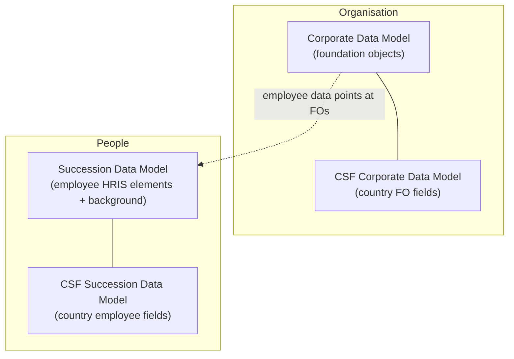

# The data model landscape

## Four models, one instance

SuccessFactors defines its data in **XML data models** uploaded to the instance. There are four, and knowing which one governs what is the first skill.

| Model | Governs | Contains |
|---|---|---|
| **Corporate Data Model (CDM)** | The **organisation** | Legacy foundation objects: their elements, fields and associations |
| **Country/Region-Specific Corporate Data Model (CSF-CDM)** | The organisation, per country | Country-specific foundation object fields (e.g. local legal-entity fields) |
| **Succession Data Model (SDM)** | The **employee** | Employee-level HRIS elements and fields, plus talent background elements and the standard/user elements |
| **Country/Region-Specific Succession Data Model (CSF-SDM)** | The employee, per country | Country-specific employee fields — addresses, national IDs, global information, local job/pay fields |

**The memory hook:** *Corporate = the company. Succession = the people. CSF = per country.* The name "Succession" is a historical accident — the file predates Employee Central and was originally about the talent profile. It is not about succession planning.

---

## What is in each model

### Corporate Data Model

- `hris-element` definitions for legacy foundation objects (e.g. `payComponent`, `payComponentGroup`, `frequency`, `eventReason`)
- Their `hris-field` definitions: id, label, visibility, required, picklist
- **Associations** between foundation objects
- Historically, the org/job/pay objects too — most of which have since moved to MDF

Because most foundation objects are now MDF-based, the CDM in a modern instance is **smaller than it used to be**, and much of what you would once have edited here is now in *Configure Object Definitions*.

### Succession Data Model

Three distinct sections, which is what confuses people:

1. **Standard elements / user elements** — the suite-level user record fields (`userinfo`, `standard-element`s such as `department`, `division`, `location` as *text* fields on the user record). These are the pre-EC talent fields.
2. **Employee-level HRIS elements** — the EC ones: `personInfo`, `personalInfo`, `homeAddress`, `emailInfo`, `phoneInfo`, `nationalIdCard`, `employmentInfo`, `jobInfo`, `compInfo`, `payComponentRecurring`, `payComponentNonRecurring`, `jobRelationsInfo`, and more.
3. **Background elements** — the talent profile lists: education, work experience, certifications, languages, and custom background elements.

Two things follow:

- In an EC instance, the **HRIS elements** section is where you spend your time.
- The **standard/user elements** still matter, because talent modules and some reports read them, and they are populated from EC. That is why a "department" can appear twice with different values if something is misconfigured.

### The CSF models

Country-specific overlays. They do not replace the base model; they **add** fields that appear only for employees in that country. Covered in [Country-specific data models](04_Country_Specific_Data_Models.md).

---

## How the models relate to everything else

| Layer | Defined by |
|---|---|
| Which fields exist on Personal Info | **SDM** |
| Which fields exist on Personal Info **for Japan** | **CSF-SDM** |
| Which fields exist on Pay Component | **CDM** |
| Which fields exist on Department | **MDF object definition** (because Department is MDF) |
| Which picklist a field uses | The model (SDM/CDM) or the MDF object definition |
| Which rule fires on save | The model / object definition (rule attachment) |
| Whether a *user* can see the field | **RBP**, not the model |
| Where the field appears on screen | **Configure People Profile** (EC blocks) or **Configuration UI** (MDF objects) |

That last distinction is the one to internalise: **the model says the field exists; RBP says who sees it; the profile/UI configuration says where it appears.** Three different places, three different failure modes.

---

## Where the models live and how they are changed

| Action | Where |
|---|---|
| Download / upload the XML | **Provisioning** (partner only) |
| Edit elements and fields without XML | **Manage Business Configuration (BCUI)** in Admin Center |
| Edit MDF object definitions | **Configure Object Definitions** in Admin Center |
| Edit country-specific fields | BCUI where exposed; otherwise the CSF XML in Provisioning |

**The modern workflow:** do it in BCUI, then export the XML afterwards for documentation. See [Business Configuration UI](07_Business_Configuration_UI.md).

---

## Decision guide — which do I open?

| I want to… | Open |
|---|---|
| Add a field to Job Information | **BCUI** → `jobInfo` (SDM) |
| Add a field to Job Information **for France only** | CSF-SDM (or BCUI's country section) |
| Add a field to Department | **Configure Object Definitions** (MDF) |
| Add a field to Pay Component | **CDM** (legacy FO) |
| Change a field's label | BCUI |
| Make a field mandatory | BCUI (`required`) |
| Hide a field from everyone | BCUI (`visibility = none`) |
| Hide a field from *some people* | **RBP**, not the model |
| Change where a block appears on the profile | **Configure People Profile** |
| Add a value to a dropdown | **Picklist Center** |
| Attach a rule to an element | BCUI (or the object definition for MDF) |

Memorising this table saves more time in a project than almost anything else in this repo.

---

## A worked example of "which model?"

Requirement: *"For Indian employees we need to capture PF (Provident Fund) number and UAN on the employee record, and our Indian legal entity needs a PF establishment code."*

| Part of the requirement | Model | Why |
|---|---|---|
| PF number + UAN on the employee | **CSF-SDM** (India) | Employee data, India only |
| PF establishment code on the legal entity | Legal Entity is MDF → **object definition** custom field, or **CSF-CDM** if the object is legacy in that instance | Organisation data, India only |
| Both appear only for India | Country-specific by construction | |
| Only payroll may see them | **RBP** | Visibility per user is never the model's job |

Two models, one MDF definition and RBP, from a single sentence of requirement. That decomposition *is* the consulting skill.

---

## Interview-grade Q&A

- **Name the data models in SuccessFactors. [HIGH]** Corporate Data Model, Country/Region-Specific Corporate Data Model, Succession Data Model, Country/Region-Specific Succession Data Model.
- **What does the Corporate Data Model contain? [HIGH]** Legacy foundation object definitions — their elements, fields and associations. Most org/job/pay objects have migrated to MDF, so a modern CDM is smaller than it once was.
- **What does the Succession Data Model contain? [HIGH]** Employee-level HRIS elements (personal, job, compensation and so on), the standard/user elements, and talent background elements.
- **Why is it called "Succession" Data Model? [MED]** History — the file predates Employee Central and originally defined the talent profile. It is not about succession planning.
- **What do the country-specific models do? [HIGH]** Add fields that appear only for employees or organisational objects in a given country, layered on top of the base models.
- **Where do you change a data model today? [HIGH]** Manage Business Configuration in Admin Center for most changes; Provisioning XML upload for what BCUI does not expose (partner only). Always export the XML afterwards for documentation.
- **The field exists but a user cannot see it. Is that a data model problem? [HIGH]** Usually not — the model says the field exists and its global visibility; **RBP** decides who sees it, and People Profile decides where it appears.
- **Where would you add a field to Department? [MED]** Department is an MDF object, so in Configure Object Definitions — not in the Corporate Data Model.

---

## Further learning

- SAP Learning — [Employee Central Core Academy](https://learning.sap.com/courses/sap-successfactors-employee-central-core-academy)
- SAP Help — [Implementing Employee Central Core](https://help.sap.com/docs/successfactors-employee-central/implementing-employee-central-core)
- Video — [Data models explained](https://www.youtube.com/watch?v=yEsquQA-MxU)
