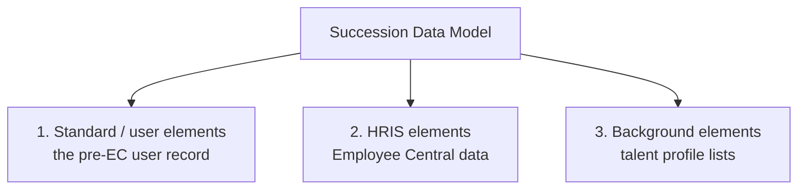

# The Succession Data Model (SDM)

## What it is

The **Succession Data Model** is the XML file that defines the **employee side** of SuccessFactors: which fields exist on the employee record, what they are called, whether they are visible, mandatory, and which picklists and rules they use.

Despite the name, it has **nothing to do with succession planning**. The file predates Employee Central — it originally defined the *talent profile*, and the name stuck. Say that in an interview and you will sound like someone who has opened the file.

---

## The three sections

This is the part that confuses everyone, so learn it deliberately.



### 1. Standard elements (the user record)

The suite-level user fields that existed before EC: `userId`, `username`, `firstName`, `lastName`, `department`, `division`, `location`, `jobCode`, `custom01`–`custom15`, and so on.

- These are **plain text fields on the user record**, not effective-dated.
- Talent modules, older reports, and some permission logic read them.
- In an EC instance they are **populated from EC data** — the department here is a copy of the department on Job Information.
- Consequence: if the sync is misconfigured, "department" can show two different values in two places. That is a real, recurring support ticket.

### 2. HRIS elements (Employee Central)

The heart of an EC instance. Each `hris-element` is a block of employee data:

| Person level | Employment level |
|---|---|
| `personInfo` (Biographical) | `employmentInfo` |
| `personalInfo` | `jobInfo` |
| `homeAddress` | `compInfo` |
| `emailInfo` | `payComponentRecurring` |
| `phoneInfo` | `payComponentNonRecurring` |
| `nationalIdCard` | `jobRelationsInfo` |
| `emergencyContactPrimary` | `workPermitInfo` |
| `personRelationshipInfo` | `globalAssignmentInfo` |
| `imInfo`, `socialAccountInformation` | |

Full lookup: [HRIS elements and fields reference](05_HRIS_Elements_and_Fields_Reference.md).

### 3. Background elements

The talent-profile lists: `background_education`, `background_workExperience`, `background_certificates`, `background_languages`, plus custom ones.

- Not effective-dated — they are **lists you add rows to**.
- Rendered as blocks on People Profile alongside EC blocks, which is why users cannot tell them apart.
- Used by Succession, Development and Recruiting.

**The distinguishing test**, worth memorising: *if the block has History with effective dates and an event reason, it is an HRIS element (EC). If it is a list you simply add rows to, it is a background element.*

---

## What an HRIS element looks like

```xml
<hris-element id="personalInfo">
    <label>Personal Information</label>

    <hris-field max-length="128" id="first-name" required="true" visibility="both">
        <label>First Name</label>
        <label xml:lang="de-DE">Vorname</label>
    </hris-field>

    <hris-field max-length="128" id="last-name" required="true" visibility="both">
        <label>Last Name</label>
    </hris-field>

    <hris-field id="marital-status" required="false" visibility="both">
        <label>Marital Status</label>
        <picklist id="maritalStatus"/>
    </hris-field>

    <hris-field id="custom-string1" required="false" visibility="both">
        <label>Preferred Pronouns</label>
    </hris-field>

</hris-element>
```

And rules are attached at element level:

```xml
<hris-element id="jobInfo">
    <label>Job Information</label>
    ...
    <hris-field id="cost-center" visibility="both" required="false">
        <label>Cost Center</label>
    </hris-field>
    ...
</hris-element>
```

with the rule attachment specifying the event (`onSave`, `onChange`, `onInit`) and the rule id. In modern practice you attach rules through **Manage Business Configuration**, not by hand-editing XML.

---

## The attributes you will actually set

| Attribute | What it does | Watch out for |
|---|---|---|
| `visibility` | `both` / `view` / `edit` / `none` | This is **global**, not per user. Per-user control is RBP |
| `required` | Makes the field mandatory | Mandatory fields break imports and integrations that do not supply them |
| `<label>` | Display label per locale | Change the label, not the id, when the customer wants different wording |
| `picklist` | Which picklist supplies values | Changing this on a populated field orphans existing values |
| `max-length` | Character limit | Must be at least as long as anything the source system sends |
| `pii` | Flags personally identifiable data | Feeds privacy/purge handling |
| custom placeholders | `custom-string1`…, `custom-date1`…, `custom-double1`… | Document what each one holds |

**`required="true"` deserves its own warning.** Making a field mandatory in the model means *every* path that writes the element must supply it — the UI, imports, the OData API, Recruiting-to-EC hires, and Onboarding. Teams routinely make a field mandatory in week 8 and discover in week 14 that the nightly hire interface has been failing since.

---

## The relationship to People Profile and RBP

Three layers, three failure modes — worth repeating because it is the most common troubleshooting question:

| Question | Answered by |
|---|---|
| Does the field exist at all? | **SDM / object definition** |
| Is it globally hidden? | `visibility` in the model |
| Can *this user* see it? | **RBP** field-level permission |
| Where does it appear on screen? | **Configure People Profile** |
| Does it have the right values? | Picklist |
| Does it get filled in automatically? | Propagation or business rule |

---

## Step by step — add a custom field to Personal Information

Done the modern way, through BCUI, with XML used for documentation:

1. **Requirement in writing:** field name, purpose, data type, who maintains it, who sees it, whether payroll needs it.
2. **Export the current SDM** (Provisioning or BCUI export) as `SDM_before_YYYYMMDD.xml`.
3. Admin Center → **Manage Business Configuration** → HRIS Elements → `personalInfo`.
4. Find the next unused custom field of the right type (e.g. `custom-string3`).
5. Set the **label**, **visibility** (`both`), **required** (usually `false`), **max length**, and attach a **picklist** if the values are constrained.
6. Save.
7. **Manage Permission Roles** → grant the field to the roles that need view or edit. *Until you do this, nobody sees it — including you.*
8. Open a test employee and confirm the field renders, is labelled correctly and saves.
9. Check **imports**: download the Personal Information template and confirm the new column appears.
10. Check **OData**: the field is exposed on `PerPersonal` — tell the integration team its technical name.
11. **Export the SDM again**, diff it, and file both versions with the workbook — recording that `personalInfo.custom-string3` = *Preferred Pronouns*, added on this date, owned by HR Operations.
12. Promote to TEST, retest, then PROD.

Steps 7 and 11 are the ones beginners skip, and each costs a day when skipped.

---

## Real world example

A customer wants to capture **"Works Council Member (Y/N)"** on the employee record for German employees, visible only to HR.

Design decisions:

| Question | Answer |
|---|---|
| Which element? | `jobInfo` — it can change over time and should be effective-dated with history |
| Base model or country-specific? | **CSF-SDM for Germany** — the field is meaningless elsewhere and would clutter every other country |
| Picklist or checkbox? | A picklist with Yes/No, so reporting is clean and translations are possible |
| Who sees it? | HR Admin and HR Business Partner roles only — **RBP**, not `visibility` |
| Does payroll need it? | Yes → add it to the replication mapping |
| Effective-dated? | Yes, because works-council membership starts and ends on dates |

Notice how much of the design is *not* about the XML. The XML change is five minutes; the decisions above are the work.

---

## Common mistakes

- **Confusing the standard/user element `department` with the EC `jobInfo` department** — leading to "the org chart shows the old department".
- Using `visibility="none"` to hide a field **from some users** — that is RBP's job; `visibility` is global.
- Making a field `required="true"` without checking every inbound interface.
- **Reusing a custom placeholder** that already holds data.
- Changing a **picklist** on a populated field, orphaning existing values.
- Adding a field to the **base model** when it is relevant to one country only.
- Forgetting to **permission the new field**, then reporting it as a product defect.

---

## Interview-grade Q&A

- **What is the Succession Data Model? [HIGH]** The XML defining employee-side configuration: the standard/user elements, the Employee Central HRIS elements and their fields, and the talent background elements.
- **Why is it called "Succession"? [MED]** Historical — it predates EC and originally defined the talent profile. It has nothing to do with succession planning.
- **What are the three sections? [HIGH]** Standard/user elements (the pre-EC user record), HRIS elements (EC employee data), and background elements (talent profile lists).
- **How do you tell an HRIS element from a background element in the UI? [MED]** HRIS elements have effective-dated History with event reasons; background elements are simple lists of rows.
- **What is an `hris-field` and its key attributes? [HIGH]** One field in an element, with `id`, `visibility` (`both`/`view`/`edit`/`none`), `required`, `max-length`, a label per locale, and optionally a picklist.
- **Difference between `visibility="none"` and an RBP field restriction? [HIGH]** `visibility` hides the field from everyone globally; RBP hides it from specific roles. Use RBP for user-dependent visibility.
- **What are the risks of `required="true"`? [HIGH]** Every write path — UI, imports, OData, Recruiting/Onboarding hires — must supply the field, so interfaces that do not will start failing.
- **How do you add a custom field? [HIGH]** Take an unused custom placeholder in the element, set label, visibility, required and picklist in BCUI, permission it in RBP, test the UI, imports and OData, then export and document the XML.
- **Where do you attach a business rule to an element? [HIGH]** In Manage Business Configuration on the HRIS element, specifying the trigger (onInit / onChange / onSave / onPostSave).

---

## Further learning

- SAP Learning — [Employee Central Core Academy](https://learning.sap.com/courses/sap-successfactors-employee-central-core-academy) — Configuring employee data
- SAP Help — [Implementing Employee Central Core](https://help.sap.com/docs/successfactors-employee-central/implementing-employee-central-core)
- Video — [Data models: SDM vs CDM](https://www.youtube.com/watch?v=yEsquQA-MxU)
