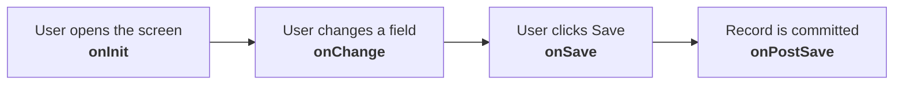

# Trigger points — onInit, onChange, onSave, onPostSave

The scenario decides what a rule *can see*. The **trigger** decides *when it runs*. Choosing the wrong trigger is the second most common rule defect, after null handling.

---

## The four triggers

| Trigger | Fires | Can it block the save? | Typical use |
|---|---|---|---|
| **onInit** | When the screen/record is opened or a transaction is started | No | Defaulting values before the user types |
| **onChange** | When a specific field's value changes | No | Deriving dependent fields as the user works |
| **onSave** | When the user saves, before the record is written | **Yes** — can raise an error | Validation, final derivation, event reason |
| **onPostSave** | After the record is committed | No | Follow-on actions once the data exists |

---

## onInit — defaulting on open

Runs when the transaction or screen is initialised.

**Good for:**
- Pre-filling a field before the user sees it (default event reason, default effective date behaviour, default values on a new MDF record)
- Setting a value that the user may then override

**Watch out for:**
- **Almost everything is empty** at onInit — the user has not chosen anything yet. A rule reading Department at onInit on a new hire will read null.
- It fires on *opening*, so it can overwrite a value the user is coming back to edit unless you guard with a null check.

**The standard guard:** `IF <target field> is null THEN set it` — so the default only applies when nothing is there.

---

## onChange — deriving as the user works

Attached to a **specific field**; fires when that field's value changes.

**Good for:**
- Dependent derivation: department changes → derive cost centre; job classification changes → derive pay grade; legal entity changes → derive pay group
- Immediate feedback while the user is still on the screen

**Watch out for:**
- It fires on **every** change of that field, including changes made by another rule — which is how you get cascading or looping behaviour.
- The user may fill the screen in **any order**. An onChange rule on Cost Centre that reads Location will get null if the user has not chosen a location yet.
- It does **not** fire if the field is populated by import or API — those paths do not simulate UI field changes.

**Design habit:** for anything that must *always* be correct, put the authoritative logic at **onSave** and use onChange only for a helpful, immediate default.

---

## onSave — validation and final derivation

Fires when the user saves, **before** the record is written. The only trigger that can **stop** the save.

**Good for:**
- **Validation** — raise an error and block ("salary is outside the pay range"), or raise a warning and allow
- **Final derivation** — event reason, employee status, anything that depends on the complete final state of the record
- Cross-entity logic, where you need the whole picture

**Watch out for:**
- Everything here runs **synchronously** — heavy rules make saving slow.
- Multiple onSave rules run in **sequence**; if two write the same field, the last wins. See [Attaching rules](04_Attaching_Rules.md).
- Errors here are user-facing: write messages people can act on ("Salary 92,000 exceeds the maximum 81,000 for grade G7 in UK-LONDON"), not "Validation failed".

**This is where most important EC rules live.** If you are unsure which trigger to use, onSave is usually the safe answer.

---

## onPostSave — after the fact

Fires **after** the record has been committed.

**Good for:**
- Actions that need the record to exist first
- Creating or updating related records
- Triggering downstream processes

**Watch out for:**
- It **cannot block** anything — the data is already saved.
- Failures here are harder to see, because the user's save already succeeded.
- Availability varies by entity and release; do not assume it exists everywhere.

---

## Choosing the trigger — a decision table

| Requirement | Trigger |
|---|---|
| Pre-fill a value before the user starts | **onInit** |
| Derive field B when the user changes field A | **onChange** on A |
| Make sure a value is always right, whatever the user did | **onSave** |
| Prevent the user saving invalid data | **onSave** (error) |
| Warn but allow | **onSave** (warning) |
| Derive event reason | **onSave** |
| Do something once the record exists | **onPostSave** |
| Something that must also work for imports and API writes | **onSave** — and confirm rules are enabled for that path |

---

## Interaction and ordering

Three things about ordering that cause real defects:

1. **onChange then onSave.** A field derived at onChange can be overwritten at onSave, or vice versa. Decide which is authoritative and make the other consistent.
2. **Multiple rules at the same trigger** run in the configured **sequence**. If rule A sets the pay grade and rule B validates against it, B must come after A.
3. **Propagation vs rules.** Propagation fires on selection; a rule at onSave will overwrite whatever propagation put there. If a propagated value keeps "changing itself", look for a rule at onSave.

---

## Rules and non-UI paths

A point interviewers use to separate theory from experience:

| Write path | Do rules run? |
|---|---|
| UI (People Profile, Take Action) | Yes, all triggers |
| **Import Employee Data** | Depends on the import's rule setting — usually **off** for migration, on for ongoing loads |
| **OData API** | onSave-type validation generally applies; onChange (a UI event) does not |
| **Integration Center** writes | Same as OData |
| Recruiting/Onboarding hire into EC | Rules apply, and this is where a newly-mandatory field breaks the interface |

**The practical consequence:** never rely on an onChange rule to guarantee data quality. If it must always be true, it belongs at onSave — and even then, check the import setting.

---

## Worked example — one requirement, three triggers

*"When hiring, default the probation end date to hire date + 6 months; if the manager changes the department, update the cost centre; and never allow a save where the probation end date is before the hire date."*

| Part | Trigger | Rule |
|---|---|---|
| Default probation end date | **onInit** (or onChange of hire date) | If probation end is null and hire date is not null → set = AddMonths(hire date, 6) |
| Update cost centre on department change | **onChange** of Department | If department is not null → set cost centre from the department's cost centre |
| Prevent an invalid probation date | **onSave** | If probation end is not null and hire date is not null and probation end < hire date → raise error |

Three triggers, three rules, each doing one thing. That is the shape of a maintainable rule set.

---

## Common mistakes

- **onChange used for a mandatory derivation**, which then does not happen for imports or API writes.
- **onInit rules overwriting** existing values, because there is no null guard.
- **Validation at onPostSave**, where it cannot block anything.
- **Two rules at the same trigger** writing the same field.
- **Heavy onSave rules with multiple lookups**, making saves noticeably slow.
- **Unhelpful error messages** that tell the user something failed but not what to do.
- Assuming **onChange fires for imports** — it does not.

---

## Interview-grade Q&A

- **Name the rule trigger points and when each fires. [HIGH]** onInit when the screen or transaction is initialised; onChange when a specific field's value changes; onSave when the user saves, before the record is written; onPostSave after the record is committed.
- **Which trigger can block a save? [HIGH]** onSave — it is the only one that can raise a blocking error.
- **Where would you derive the event reason? [HIGH]** onSave, because it depends on the final state of the record.
- **Why is onChange unreliable for mandatory logic? [HIGH]** It only fires on UI field changes, so imports and API writes bypass it; anything that must always be true belongs at onSave.
- **What is the risk with onInit? [MED]** Almost all fields are empty at that point, and without a null guard the rule can overwrite values the user already had.
- **What is onPostSave for? [MED]** Actions that require the record to exist — creating related records or triggering follow-on processes. It cannot block anything.
- **Two rules at the same trigger write the same field. What happens? [HIGH]** They run in the configured sequence and the last one wins — which is why you never configure that deliberately.
- **Do rules run during imports? [HIGH]** It depends on the import's rule setting; for migration loads rules are usually switched off so defaults do not overwrite migrated values.
- **A propagated value keeps getting overwritten. Why? [MED]** A rule at onSave is writing the same field after propagation set it.

---

## Further learning

- SAP Learning — [Employee Central Core Academy](https://learning.sap.com/courses/sap-successfactors-employee-central-core-academy) — Creating business rules for EC
- SAP Help — [Implementing Employee Central Core](https://help.sap.com/docs/successfactors-employee-central/implementing-employee-central-core)
- Video — [Business rules triggers](https://www.youtube.com/watch?v=90aPAtJbl9g)
