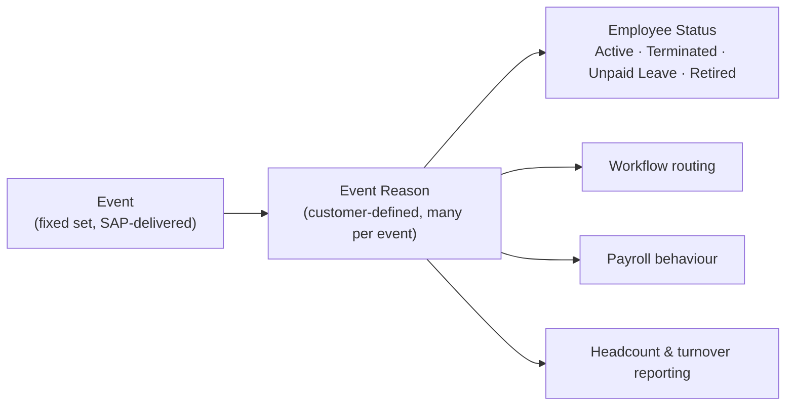

# Events and Event Reasons

## The concept

Every effective-dated Job Information row carries two fields that say **what happened**:

- **Event** — the *category* of change: Hire, Job Change, Transfer, Promotion, Termination, Leave of Absence, Data Change…
- **Event Reason** — the *specific* reason within that category: "Promotion — merit", "Termination — resignation", "Transfer — intercompany".

In SAP HCM terms: **Event ≈ Action type (IT0000), Event Reason ≈ Reason for action.** The crucial difference is that EC has **no separate action record** — the event and reason are fields *on* the job row, so the history of actions and the history of job data are the same list.

Analogy: a bank statement line has an amount *and* a transaction type ("salary", "refund", "fee"). The amount alone tells you the balance changed; the type tells you why. Event reason is the transaction type of HR.

---

## The relationship

- **Events** come from a delivered list. You do not invent new events.
- **Event Reasons** are configured by the customer, each linked to exactly one event.
- The link is a **cascading picklist**: pick the event, see only its reasons. See [Picklists](../04_Data_Models/08_Picklists.md).

---

## The standard events

| Event | Used for |
|---|---|
| **Hire** | A new employment starts |
| **Rehire** | A former employee returns |
| **Job Change** | Job, working time or job attributes change |
| **Promotion** | Upward move |
| **Demotion** | Downward move |
| **Transfer** | Move between organisational units, locations or legal entities |
| **Data Change** | A correction or an administrative change |
| **Termination** | Employment ends |
| **Leave of Absence** | Employee goes on leave |
| **Return to Work** | Employee returns from leave |
| **Suspension** | Employment suspended |
| **Pay Rate Change** | Compensation change (on `compInfo`) |
| **Assignment / Away from Company** events | Global assignment scenarios |
| **Position Change** | Where position management is used |

*(Availability varies by release and by which features are enabled.)*

---

## What an Event Reason configures

An Event Reason is a foundation object with attributes that make it far more than a label:

| Attribute | Effect |
|---|---|
| **Event** | Which event it belongs to (drives the cascading picklist) |
| **Employee Status** | The status the employee takes — **Active**, **Terminated**, **Unpaid Leave**, **Paid Leave**, **Retired**, **Suspended**, **Discarded** |
| **Employment Status / is-termination flag** | Whether this ends the employment |
| **Payroll relevance** | Whether and how the change is sent to payroll |
| **Country/legal entity applicability** | Some reasons exist only for some countries |
| **Description and translations** | What users read |
| **Custom fields** | Grouping for reporting (e.g. voluntary/involuntary) |

**The employee status link is the important one.** It is why choosing "Termination — resignation" makes the employee Terminated, and why choosing a leave reason makes them Unpaid Leave. Users do not set status directly; the reason does.

---

## Designing the catalogue

This is a workshop deliverable, not a configuration task. The design questions:

1. **What does HR need to report on?** Turnover by voluntary/involuntary; promotions per year; internal mobility. Every reporting requirement implies reasons that distinguish those cases.
2. **What does payroll need to distinguish?** Some changes are retro-relevant, some are not.
3. **What drives different approvals?** Workflow routing usually keys off the reason.
4. **What is legally required per country?** Some countries require specific termination categories.
5. **How many can users cope with?** More than about 60 and users pick badly.

**A good catalogue is 25–60 reasons.** Fewer and you cannot report; more and the data quality collapses.

### External code convention

Design it deliberately — see the worked example in [Picklists](../04_Data_Models/08_Picklists.md). Prefix by event so the code is self-documenting:

| Code | Label | Event | Status |
|---|---|---|---|
| `HIRE_NEW` | New hire | Hire | Active |
| `HIRE_REHIRE` | Rehire | Rehire | Active |
| `JC_PROMOTION` | Promotion | Promotion | Active |
| `JC_LATERAL` | Lateral move | Job Change | Active |
| `JC_FTE_CHANGE` | Working time change | Job Change | Active |
| `TR_INTERNAL` | Internal transfer | Transfer | Active |
| `TR_INTERCOMPANY` | Intercompany transfer | Transfer | Active |
| `LOA_MATERNITY` | Maternity leave | Leave of Absence | Paid Leave |
| `LOA_UNPAID` | Unpaid leave | Leave of Absence | Unpaid Leave |
| `RTW_STANDARD` | Return to work | Return to Work | Active |
| `TERM_RESIGNATION` | Resignation | Termination | Terminated |
| `TERM_DISMISSAL_PERF` | Dismissal — performance | Termination | Terminated |
| `TERM_REDUNDANCY` | Redundancy | Termination | Terminated |
| `TERM_RETIREMENT` | Retirement | Termination | Retired |
| `DC_CORRECTION` | Data correction | Data Change | Active |

Never numeric codes. See the "why" in the [Picklists](../04_Data_Models/08_Picklists.md) worked example.

---

## Where event reasons come from at runtime

Three routes, usually combined:

1. **Set by the transaction.** Terminate sets a termination event; the hire process sets Hire.
2. **Derived by rule.** The system infers the reason from what changed — see [Event reason derivation](../06_Business_Rules/06_Event_Reason_Derivation.md).
3. **Chosen by the user**, from a cascading filtered list, usually restricted to HR roles.

Most projects use derivation with an HR-only override, validated by a rule.

---

## Step by step — configure an event reason

1. Agree the catalogue with HR and Payroll, in a table, signed off.
2. Admin Center → **Manage Organization, Pay and Job Structures** (legacy) or **Manage Data** → **Event Reason**, depending on your instance.
3. Create the record:
   - External code following the convention
   - Name and translations
   - **Event**
   - **Employee status**
   - Payroll relevance
   - Country applicability if it is country-specific
4. Ensure the **cascading picklist** (event → reason) includes it.
5. Update the **derivation rule** if the reason should be inferred automatically.
6. Update the **workflow derivation rule** if it needs different routing.
7. Update the **payroll interface mapping** if payroll must treat it specially.
8. **Test**: perform the transaction, check the resulting status, the workflow that routed, and the payroll extract.
9. Check the **reports** that group by reason still make sense.
10. Document it.

Steps 6–9 are the ones that get skipped, and they are why "we added a new event reason" turns into a production incident.

---

## Real world example

A customer adds a "Transfer to associated company" reason for moves to a joint venture.

What it touched:

| Area | Change |
|---|---|
| Event Reason | New record, event = Transfer, status = Active |
| Cascading picklist | Added under Transfer |
| Derivation rule | New branch: company changed AND new company is in the JV list → this reason |
| Workflow | New routing: manager → HRBP → Legal (JV moves need legal sign-off) |
| Payroll | Mapped as a leaver in the source payroll and a starter in the target — so the interface needed an explicit rule |
| Reporting | Excluded from voluntary turnover, included in "internal mobility" |
| Documents | A different transfer letter template |

One event reason, seven downstream changes. That is why event reason design is a workshop, and why interviewers use it to test whether you have really implemented EC.

---

## Common mistakes

- **Numeric or opaque codes.**
- **Too many reasons**, so users pick the first plausible one.
- **Too few**, so everything is "Data Change" and nothing is reportable.
- **Wrong employee status** on a reason — the classic being a leave reason set to Active, so people on unpaid leave still count in headcount and still get paid.
- Adding a reason **without updating the derivation rule**, so it is never used.
- Adding a reason **without the payroll mapping**, so payroll mishandles it.
- **Deleting** a reason instead of inactivating it, orphaning history.
- Not testing the **status outcome** after configuring a reason.

---

## Interview-grade Q&A

- **What is the difference between an Event and an Event Reason? [HIGH]** The event is the delivered category of change (Hire, Transfer, Termination); the event reason is the customer-defined specific reason within that event, linked to it by a cascading picklist.
- **Where are they stored? [HIGH]** As fields on each effective-dated Job Information row (and Compensation row) — EC has no separate action record.
- **What is the SAP HCM equivalent? [HIGH]** Action type and reason for action from IT0000.
- **What does an event reason configure besides its name? [HIGH]** The event it belongs to, the **employee status** it sets, payroll relevance, country applicability, and any custom grouping used for reporting.
- **How does an employee become "Terminated"? [HIGH]** The event reason used on the termination carries that status; users do not set status directly.
- **How many event reasons should a customer have? [MED]** Typically 25–60 — enough to report meaningfully, few enough that users choose correctly.
- **How do you stop users choosing badly? [HIGH]** Derive the reason with a business rule, restrict the field to HR for overrides, filter the list with a cascading picklist, and validate overrides with a rule.
- **What must you check when adding a new event reason? [HIGH]** The cascading picklist, the derivation rule, workflow routing, employee status, payroll mapping, document templates and any reports that group by reason.
- **A leave reason was configured with status Active. What breaks? [MED]** People on leave still count in headcount, may still be paid, and time and benefit eligibility behave incorrectly.

---

## Further learning

- SAP Learning — [Employee Central Core Academy](https://learning.sap.com/courses/sap-successfactors-employee-central-core-academy) — Configuring transactions
- SAP Help — [Implementing Employee Central Core](https://help.sap.com/docs/successfactors-employee-central/implementing-employee-central-core)
- Video — [Events and event reasons](https://www.youtube.com/watch?v=yEsquQA-MxU)
