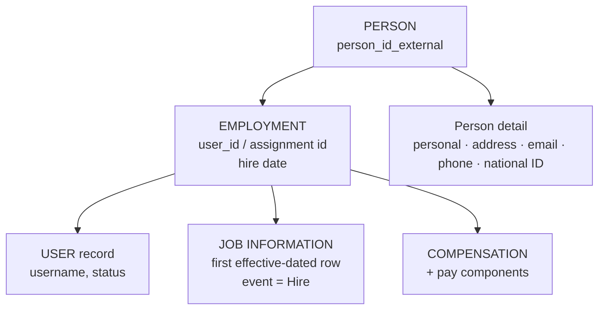

# Hire and rehire

## What a hire actually creates

Hiring is not "adding an employee". It creates a **stack of records** across three layers:

If an interviewer asks "what happens when you hire someone in EC?", that diagram is the answer: a person, a user, an employment, a first Job Information row dated the hire date with event Hire, compensation and pay components, plus the person-level detail records.

---

## The routes into EC

| Route | How it works | Typical use |
|---|---|---|
| **Manual hire** | Admin Center → *Add New Employee* / Take Action | Ad hoc, small volumes, corrections |
| **Manage Pending Hires** | Candidates flow in from **Recruiting** or **Onboarding** and are completed in EC | The normal route where RCM/ONB are implemented |
| **Import** | Import Employee Data templates | Migration and bulk loads |
| **OData / integration** | An external system upserts the records | Where another system owns hiring |

**Manage Pending Hires** is worth knowing by name: it is the queue of candidates who have been hired in Recruiting/Onboarding and are waiting to be completed as EC employees, with data pre-populated from the requisition and offer.

---

## The manual hire, step by step

1. **Add New Employee** (or Take Action → Hire, depending on configuration).
2. **Identity** — first and last name, date of birth, and the person identifiers. The system checks for potential **duplicate persons**; take that check seriously.
3. **Employment Information** — hire date, original start date, seniority date, employee class.
4. **Job Information** — legal entity, business unit, division, department, cost centre, location, job classification, position, manager, FTE, standard hours, pay group. Rules fire here: propagation from department and job, derivation of pay grade and pay group.
5. **Compensation** — pay group, grade, currency, frequency, then the pay components (base salary, allowances).
6. **Person detail** — address, email, phone, national ID, emergency contact, dependants.
7. **Save.** A workflow may route the hire for approval, in which case it becomes **pending data** until approved.
8. On completion the employee exists, the user is active, and downstream systems pick them up on their next run.

### What fires during a hire

| Mechanism | Example |
|---|---|
| Propagation | Department → cost centre; job classification → pay grade, title, standard hours |
| onInit rules | Default effective date behaviour, default event reason |
| onChange rules | Derive dependent fields as the recruiter fills the form |
| onSave rules | Validate the salary against the range; derive pay group; default seniority and probation dates |
| Workflow derivation | Route the hire for approval if configured |
| Position Management | If hiring into a position, the position's values flow into Job Information and the position's vacancy flag clears |

---

## Common hire design decisions

| Question | Considerations |
|---|---|
| Is the hire approved by workflow? | Most customers approve the *requisition* in Recruiting instead, and let EC hires apply directly — approving twice annoys everyone |
| Who may hire? | Usually HR only; some customers allow managers for specific worker types |
| How far in advance? | Future-dated hires are normal; decide how far ahead and how the user account activates |
| What is the username convention? | Usually derived by rule or written from Active Directory |
| When does IT provisioning trigger? | An integration on hire, often on a lead time before the start date |
| Contingent workers | A separate worker type, usually no compensation, excluded from headcount |

---

## Rehire

**Rehire is where the Person/Employment separation earns its keep.**

When a former employee returns:

- The **person** already exists — same `person_id_external`, same date of birth, same national ID.
- A **new employment** is created, with a new hire date.
- Person-level data (biographical, national ID) is reused, not duplicated.
- **`original-start-date`** preserves the first ever start; **`seniority-date`** is set according to the customer's service-bridging policy.

### The rehire process

1. Search for the person **before** creating anything. This is the critical step.
2. If found, use the **Rehire** action (Take Action → Rehire, or the rehire path in Manage Pending Hires).
3. Check **rehire eligibility** — the `okay-to-rehire` flag set at termination.
4. Enter the new hire date and job details.
5. Set the seniority date deliberately, per policy.
6. Save; the person now has two employments.

### The failure mode

If the recruiter does not find the existing person, they create a **new person** — and now:

- The same human exists twice, with two person IDs.
- Their national ID appears twice, which may be a compliance issue.
- Service history is split, so long-service awards and benefit eligibility are wrong.
- Downstream systems receive two people.
- Merging afterwards is painful and often impossible.

**Mitigations:** a strong duplicate check at hire (name + date of birth + national ID), a rule or report that flags potential duplicates, and training the recruiting team to search first. Say this in an interview — it shows operational awareness.

### Rehire design questions

| Question | Options |
|---|---|
| New user ID or reuse the old one? | New is cleaner and more common; reusing preserves talent history but complicates reporting |
| Bridge service? | Policy decision: sometimes yes if the break was under N months |
| Reuse the old talent data? | Person-level data carries over; talent records depend on user-id policy |
| What if the old employment is still open? | It should not be — check for an unterminated prior employment first |

---

## Rehire vs a new hire vs a transfer

A frequent scenario question:

| Situation | Correct handling |
|---|---|
| Employee left in 2023, returns in 2025 | **Rehire** — same person, second employment |
| Employee moves from ACME UK to ACME Germany, staying employed | A **transfer** (Job Information change of company) *or* terminate-and-rehire — a documented design decision with payroll, seniority and reporting consequences |
| Contractor becomes an employee | Usually terminate the contingent worker assignment and hire as an employee — same person, new employment |
| Employee returns from a global assignment | Neither — the assignment employment ends and the home employment continues |
| Two people with the same name | Two persons; the duplicate check must distinguish them by date of birth and national ID |

---

## Real world example

A retailer with heavy seasonal hiring rehires roughly 1,800 people every November.

What they built:

1. **Bulk rehire by import** rather than manual, keyed on `person_id_external` from the previous season.
2. A pre-load **matching report**: last season's leavers matched to this season's list by national ID, producing the person IDs.
3. A rule that **preserves seniority** where the break is under 12 months, so returning staff keep their holiday entitlement tier.
4. A **duplicate check report** run after each load: same national ID across different person IDs.
5. Rehire eligibility checked in the extract — anyone flagged "not eligible for rehire" was excluded and reviewed by HR.

The matching report is the interesting part: without it, a bulk rehire becomes a bulk duplicate-person creation.

---

## Common mistakes

- **Creating a new person on rehire** instead of finding the existing one.
- **Defaulting seniority date from the new hire date** and losing prior service (the rule needs a null guard — see [Common rule recipes](../06_Business_Rules/05_Common_EC_Rule_Recipes.md)).
- Not checking **rehire eligibility**.
- Hiring into a **position that is not vacant**, or into structures that do not exist yet.
- Future-dated hires whose **user account activates too early or too late**.
- Forgetting that a **workflow** on hire means the employee does not exist until approved — and downstream integrations therefore do not see them.
- No **duplicate detection** at all.

---

## Interview-grade Q&A

- **What records are created when you hire someone? [HIGH]** A person, a user record, an employment, the first effective-dated Job Information row with event Hire, Compensation Information with pay components, and the person-level detail records (address, contact, national ID).
- **What is Manage Pending Hires? [HIGH]** The queue of candidates hired in Recruiting or Onboarding awaiting completion as EC employees, pre-populated from the requisition and offer.
- **What happens on rehire? [HIGH]** The same person gains a **second employment** with a new hire date; person-level data is reused, and `original-start-date` preserves the first ever start while `seniority-date` follows the customer's bridging policy.
- **What is the biggest risk on rehire? [HIGH]** Creating a duplicate person — splitting service history, duplicating the national ID, and confusing every downstream system. Mitigate with duplicate checks on name, date of birth and national ID, plus a duplicate report.
- **Where is rehire eligibility stored? [MED]** As a flag on Employment Information, set during termination and checked at rehire (and by Recruiting when a former employee applies).
- **Employee moves between legal entities — rehire or transfer? [HIGH]** A design decision. Transfer keeps one employment and preserves continuity; terminate-and-rehire creates a new employment and may suit payroll and local legal practice. Decide with payroll and HR, and document it.
- **Can you hire with a future date? [MED]** Yes, routinely — the record applies on its effective date, and user activation and downstream provisioning are timed accordingly.
- **What fires during a hire? [MED]** Propagation from department and job classification, onInit/onChange/onSave rules for defaulting and validation, workflow derivation, and position management updates if hiring into a position.

---

## Further learning

- SAP Learning — [Employee Central Core Academy](https://learning.sap.com/courses/sap-successfactors-employee-central-core-academy) — Configuring transactions
- SAP Help — [Implementing Employee Central Core](https://help.sap.com/docs/successfactors-employee-central/implementing-employee-central-core)
- Video — [Employee lifecycle walkthrough](https://www.youtube.com/watch?v=qkmFdj4h4rA)
