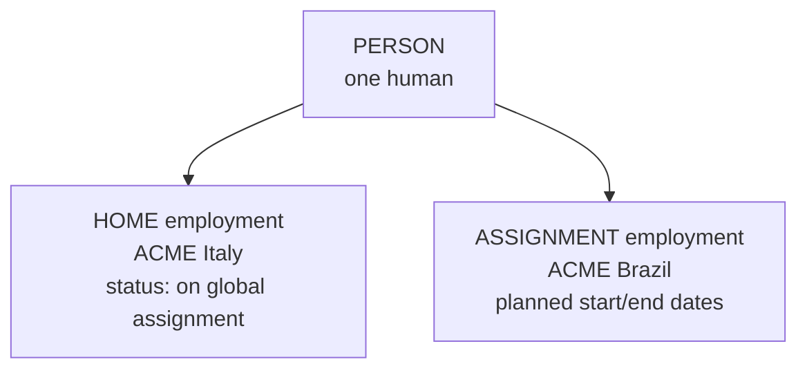

# Global assignment and concurrent employment

The two scenarios where **one person has more than one employment at the same time**. They are the practical proof of why EC separates Person from Employment, and they are a reliable interview topic because they expose whether you actually understand the data model.

Both are **enabled features** — they must be switched on (a Provisioning task) before the transactions appear.

---

## Global assignment

### What it is

An employee is sent from their **home** country/legal entity to a **host** country/legal entity for a defined period, then returns. Common for expatriates, project secondments and development moves.

### How EC models it

- The **home employment continues** but takes a specific status indicating the person is away.
- A **second employment** is created for the assignment, in the host legal entity.
- Person-level data (biographical, national ID, dependants) is **shared**.
- The person gains **host-country** data: a Brazilian national ID, a Brazilian address, Brazilian Global Information.
- Each employment has its own Job Information, Compensation, pay group and country-specific fields.

### The transactions

| Action | Effect |
|---|---|
| **Add Global Assignment** | Creates the assignment employment with planned start and end dates; sets the home employment's status |
| **End Global Assignment** | Ends the assignment employment |
| **Return from Global Assignment** | Restores the home employment to active |
| Extend / change the assignment | Adjusts planned dates |

### Design questions

| Question | Considerations |
|---|---|
| Who pays? | Home payroll, host payroll, or split — this drives whether compensation exists on one or both employments |
| Which is primary? | Usually the home employment, for reporting and headcount |
| How is headcount counted? | Count once, not twice — reports must filter on primary employment or exclude assignment types |
| What about benefits? | Home, host, or an expatriate scheme — usually a separate design conversation |
| Time and absence? | Which calendar and which entitlement applies |
| Which manager? | Usually the host manager operationally, home manager for career — often modelled with job relationships |

**The headcount point is the classic mistake:** naïve reports count employments, so every expatriate is counted twice, and the CHRO's number is wrong.

---

## Concurrent employment

### What it is

One person holds **two or more active employments at the same time** — not a temporary assignment, but genuinely two jobs.

Real examples:

- A nurse who also lectures at the affiliated university (60% + 40%, two legal entities).
- A retail employee working in two stores with different managers and cost centres.
- An academic with a clinical contract and a teaching contract.

### How EC models it

- One **person**, several **active employments**.
- Each employment has its own Job Information (job, manager, department, FTE), Compensation, and often its own pay group.
- One is flagged **primary** (`is-primary-employment`).
- Person-level data is shared — one address, one national ID, one date of birth.

### The transactions

| Action | Effect |
|---|---|
| **Manage Concurrent Employment / Add Employment** | Creates an additional active employment for an existing person |
| Terminate one employment | Ends that employment only; the other continues |
| Change primary | Switches which employment is primary |

### Design questions

| Question | Considerations |
|---|---|
| Total FTE | Two employments at 0.6 and 0.4 total 1.0 — do rules and reports understand that? Can total FTE exceed 1.0? |
| Headcount | One person, two employments — count people, not employments |
| Which manager sees what? | Each manager should see only their own assignment's data; RBP must be designed for this |
| Self-service | The employee has two records — which one do they see, and can they tell them apart? |
| Payroll | Two payslips, or one combined? Usually two, sometimes with aggregation for tax |
| Time | Working-time limits across both jobs may be a legal requirement |
| Talent | Which employment do performance and goals attach to? |

---

## Global assignment vs concurrent employment

| | **Global assignment** | **Concurrent employment** |
|---|---|---|
| Purpose | Temporary international move | Two genuine simultaneous jobs |
| Home employment | Continues, in a special status | Both are ordinary active employments |
| Time-bounded | Yes — planned start and end | No |
| Return process | Yes | No |
| Typical driver | Mobility policy | Operational or contractual necessity |
| Countries | Usually two | Often the same country |

---

## What both scenarios break if you are not careful

This list *is* the interview answer to "what do you have to watch out for?"

1. **Headcount reporting** — reports counting employments double-count. Count distinct persons, or filter to primary.
2. **Manager visibility** — each manager should see only their own employment's data; badly designed RBP shows both.
3. **Self-service** — the employee sees two records and cannot tell them apart unless the UI is configured to label them.
4. **Payroll routing** — each employment must reach the right payroll with the right pay group.
5. **Integrations** — downstream systems that assume one employee = one record will break. Every interface must be tested with a concurrent/assignment case.
6. **Business rules** — a rule assuming a single employment can read the wrong one.
7. **Time and benefits** — entitlements may need to be calculated across employments, not per employment.
8. **Person-level updates** — an address change applies to the person, so it affects both employments. That is correct, and it surprises people.
9. **Termination** — terminating one employment must not deactivate the user if the other is still active.

That last point is a genuine and commonly missed defect: the user account belongs to the person's active employments collectively.

---

## Step by step — set up a global assignment

1. Confirm **Global Assignment is enabled** (Provisioning).
2. Configure the **event reasons** for assignment start, end and return, with the right statuses.
3. Configure the **assignment types** (long-term, short-term, commuter) if used.
4. Ensure the **host country** is enabled with its country-specific data model, pay components and pay group.
5. Configure **RBP** so home and host HR each see what they need.
6. Design **headcount reporting** to avoid double counting.
7. Test: create an assignment, check both employments exist, check statuses, check payroll routing for each, check the org chart, check reports.
8. Test the **return** as well — half the defects appear at the end of the assignment, not the start.

Step 8 is the one projects skip because go-live has no returns yet. Two years later, the first return fails.

---

## Real world example

A university with 400 concurrent employments — clinicians who also teach.

| Requirement | Solution |
|---|---|
| Two contracts, two managers, two cost centres | Two active employments per person |
| One person for HR records | Shared person-level data |
| Headcount must be 3,800 people, not 4,200 employments | Reports count distinct persons; a "primary employment" flag identifies the main role |
| Clinical manager must not see teaching pay | RBP target populations scoped by employment; field-level restrictions on compensation |
| Two payslips | Two pay groups; the payroll interface keyed on assignment id, not person id |
| Working-time regulations across both roles | A report summing FTE across employments per person, with an alert above 1.0 |
| Employee self-service confusion | The profile labels each employment with its legal entity and job title |

The payroll interface point is the crucial technical one: an interface keyed on `person_id_external` sends one record and loses the second job. Keyed on the **assignment id**, it works.

---

## Interview-grade Q&A

- **What is concurrent employment? [HIGH]** One person holding two or more active employments at the same time, each with its own Job Information, Compensation, manager and often pay group, sharing person-level data, with one flagged primary.
- **What is a global assignment? [HIGH]** A temporary move to a host legal entity, modelled as a second employment with planned start and end dates while the home employment continues in a special status; the person gains host-country data and returns at the end.
- **Why are Person and Employment separate? [HIGH]** Precisely so these scenarios work: person-level facts are shared, while each working relationship has its own job, pay and country-specific data.
- **What breaks if you are not careful with these? [HIGH]** Headcount double-counting, manager visibility across employments, payroll routing, integrations that assume one record per person, rules that read the wrong employment, benefits and time entitlements, and user deactivation when only one employment ends.
- **How do you count headcount with concurrent employment? [HIGH]** Count distinct persons, or filter to the primary employment — never count employments.
- **Does an address change affect both employments? [MED]** Yes — address is person-level and therefore shared. That is correct behaviour and worth explaining to users.
- **What happens to the user account when one of two employments is terminated? [HIGH]** The user must stay active while any employment is active — a commonly missed defect.
- **What must you test that projects usually skip? [MED]** The **end** of a global assignment — the return process — and every integration with a concurrent-employment test case.
- **Are these features on by default? [MED]** No — both are enabled features, switched on in Provisioning, with their own event reasons and configuration.

---

## Further learning

- SAP Learning — [Employee Central Core Academy](https://learning.sap.com/courses/sap-successfactors-employee-central-core-academy) — Configuring transactions
- SAP Help — [Implementing Employee Central Core](https://help.sap.com/docs/successfactors-employee-central/implementing-employee-central-core)
- Video — [EC transactions](https://www.youtube.com/watch?v=qkmFdj4h4rA)
