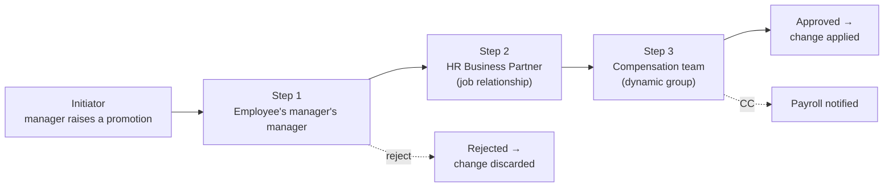

# Workflow fundamentals

## What a workflow is

A **workflow** is a configured approval chain triggered by a data change. Someone proposes a change; the workflow routes it to one or more approvers; only when it is approved does the change take effect.

Analogy: a purchase requisition. You raise it, your manager signs, finance signs, and only then does the order go out. Until then the order does not exist — but the requisition is visible and trackable.

---

## Pending data — the core concept

This is the mechanism people most often misunderstand.

When a change triggers a workflow, it is stored as **pending data**:

- The employee's **live record is unchanged**.
- The change is visible as a **pending request** on the employee's record and in the approvers' to-do lists.
- **Integrations do not see it** — payroll, identity management and reports read the live record only.
- If approved, the change is **applied** as of its effective date.
- If rejected or withdrawn, the change **disappears** and nothing is written.

Consequences worth stating in an interview:

1. *"The promotion didn't work"* is very often *"it is pending approval"*.
2. A pending change **does not stop** other changes to the same record being attempted — which is how you get conflicting pending requests.
3. A future-dated change can be approved now and take effect later.

---

## The anatomy of a workflow

| Component | Meaning |
|---|---|
| **Workflow Configuration** | The MDF object defining the whole chain |
| **Step** | One approval stage, in sequence |
| **Approver type** | How the step finds its approver |
| **Approver** | The role, person, group or relationship that must approve |
| **CC role** | People notified of the outcome, who do not approve |
| **Contributor** | People asked to add information or comment, without approving |
| **Alternate/escalation** | What happens if nobody acts within a defined time |
| **Remind in days / escalation days** | Timing configuration |
| **Edit permissions** | Whether an approver may change the data before approving |

---

## Approver types

The most important table in this note. How a workflow step decides *who* approves:

| Approver type | Resolves to | Typical use |
|---|---|---|
| **Role** (e.g. Employee's Manager, Manager's Manager) | Walks the manager hierarchy from the subject | The most common — "route to the manager" |
| **Position relationship** | The holder of a related position (e.g. the parent position's incumbent) | Position-controlled organisations |
| **Job relationship** | The person in a defined job relationship — **HR Manager**, matrix manager, custom | Routing to the HRBP; see [Job relationships](../02_Employee_Data/08_Job_Relationships_and_Dependants.md) |
| **Dynamic role** | A rule-based lookup returning a person or group | Complex routing: "the compensation partner for this business unit" |
| **Dynamic group** | A permission-style group; any member may approve | Committees, shared queues — Payroll team, Legal team |
| **Named user** | A specific person | Avoid in production — people leave |

**Design rule:** route to **relationships and groups**, not to named individuals. A workflow addressed to "Sarah Jones" breaks the day Sarah leaves, and it breaks silently.

---

## The shape of a real workflow

---

## Approve, reject, send back, withdraw

| Action | Who | Effect |
|---|---|---|
| **Approve** | Current approver | Moves to the next step, or applies the change if it is the last |
| **Reject** | Current approver | The request ends; nothing is written |
| **Send back / request more information** | Approver | Returns to the initiator or a previous step for correction |
| **Withdraw** | Initiator | Cancels their own request |
| **Delegate** | Approver | Passes their approvals to someone else for a period (holiday cover) |
| **Escalate** | System | After a configured period of inactivity, moves on or notifies someone else |
| **Admin reassign** | Workflow administrator | Forcibly moves an approval to another person — the tool for the leaver problem |

---

## Where workflows are triggered

| Trigger | Example |
|---|---|
| **HRIS element change** | Job Information, Compensation, Personal Information changes |
| **MDF object change** | Creating a new position or department |
| **Specific transactions** | Hire, termination, global assignment |
| **Self-service changes** | An employee changing their own address or bank details |

The workflow to use is chosen by a **workflow derivation rule** at onSave — see [Attaching rules](../06_Business_Rules/04_Attaching_Rules.md). If the rule returns no workflow, the change applies immediately.

That is the design lever: **not everything needs approval.** A cost centre correction by HR does not; a promotion does.

---

## Design principles

1. **Fewer steps than the customer asks for.** Workshops produce five-step workflows; five steps means five delays and five people who did not really read it. Ask what each step is *for*.
2. **Never route to named people.** Use roles, relationships and groups.
3. **Match the approval to the risk.** Money and legal entity changes need approval; a phone number does not.
4. **Design for absence.** Every workflow needs delegation and escalation, or it stalls the first time someone takes leave.
5. **Decide who may edit.** An approver who can change the data is convenient and reduces rejections, but it weakens the audit trail — the customer must choose.
6. **Consider the initiator.** If the manager raising the change is also the first approver, skip that step or the workflow is theatre.
7. **Think about the leaver.** The most common production incident is approvals stuck with someone who has left; design the reassignment process before go-live.
8. **Notifications matter.** People act on emails, not on a to-do tile they never visit.

---

## Workflows and effective dating

A subtle interaction worth knowing:

- Approval happens **now**; the change takes effect on its **effective date**.
- A future-dated change approved today sits waiting and applies on the date.
- A **retroactive** change still routes for approval, and applies retroactively once approved — with payroll consequences.
- Approving late does not change the effective date, so a promotion effective 1 March approved on 20 March is still effective 1 March, and payroll must handle retro.

---

## Real world example

A customer's original design for a promotion:

> Manager → Manager's Manager → HRBP → Compensation → HR Director → Payroll

Six steps. Average time to approval: 11 days. Managers stopped using self-service and emailed HR instead, which defeated the whole implementation.

Redesign after asking "what is each step *for*?":

| Step | Purpose | Kept? |
|---|---|---|
| Manager | Initiator — they raised it | Removed as an approval step |
| Manager's manager | Budget accountability | **Kept** |
| HRBP | Policy compliance | **Kept** |
| Compensation | Only where the increase exceeds a threshold | **Kept, conditionally** — added to the derivation rule |
| HR Director | "Visibility" | Changed to a **CC role** |
| Payroll | "Awareness" | Changed to a **CC role** |

Result: two steps for most promotions, three for large increases. Average approval time fell to under two days, and adoption recovered.

**"What is this step for?" is the most valuable question in a workflow workshop** — and this example is a strong story to tell in an interview.

---

## Common mistakes

- Routing to **named users**.
- **Too many steps**, so people bypass the system.
- No **delegation or escalation**, so workflows stall during holidays.
- Approvals **stuck with leavers**, with no reassignment process.
- Users not understanding that a pending change is **not applied**, then re-entering it and creating duplicates.
- Workflow on **every change**, including trivial ones.
- Forgetting that the **initiator may not need to approve** their own request.
- No **notification** configuration, so approvers never know.

---

## Interview-grade Q&A

- **What is a workflow in EC? [HIGH]** A configured approval chain triggered by a data change; until it completes, the change is held as pending data and the live record is unchanged.
- **What is pending data? [HIGH]** The proposed change awaiting approval. It is visible on the record and in approvers' to-do lists, is invisible to integrations and reports, and is applied only on approval — or discarded on rejection.
- **Name the approver types. [HIGH]** Role (manager hierarchy), position relationship, job relationship (e.g. HR Manager), dynamic role, dynamic group, and named user — which should be avoided in production.
- **How would you route to the employee's HRBP? [HIGH]** Maintain an HR Manager job relationship (ideally derived by rule) and use approver type *job relationship* on that step.
- **What is a CC role? [HIGH]** Participants notified of the workflow outcome who do not approve; a contributor is asked to add information or comment without approving.
- **How is the workflow chosen for a given change? [HIGH]** A workflow derivation rule at onSave returns a workflow configuration; if none is returned, the change applies immediately.
- **A manager says their promotion "didn't work". What is the likely cause? [HIGH]** It is pending approval — the live record is unchanged until the workflow completes.
- **How do you stop workflows stalling? [HIGH]** Delegation for planned absence, escalation after a configured period, group-based approvers so any member can act, and an administrative reassignment process for leavers.
- **Does approving change the effective date? [MED]** No. A change effective 1 March approved on 20 March is still effective 1 March, and payroll handles it retroactively.
- **How many approval steps should a workflow have? [MED]** As few as the risk justifies — usually one to three. Ask what each step is *for*; steps that exist only for visibility should be CC roles.

---

## Further learning

- SAP Learning — [Employee Central Core Academy](https://learning.sap.com/courses/sap-successfactors-employee-central-core-academy) — transactions and workflows
- SAP Help — [Implementing Employee Central Core](https://help.sap.com/docs/successfactors-employee-central/implementing-employee-central-core)
- Video — [Workflows in EC](https://www.youtube.com/watch?v=qkmFdj4h4rA)
